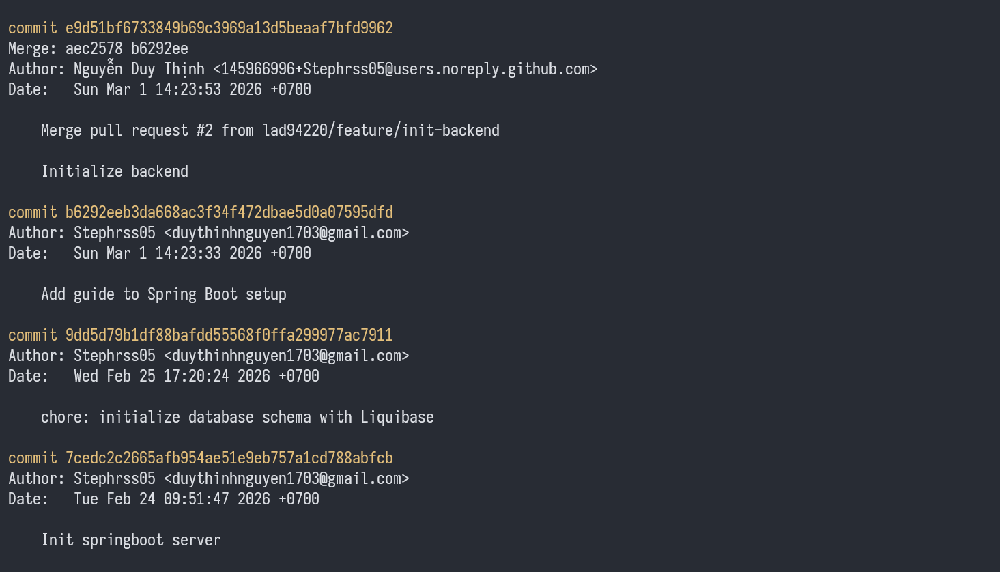
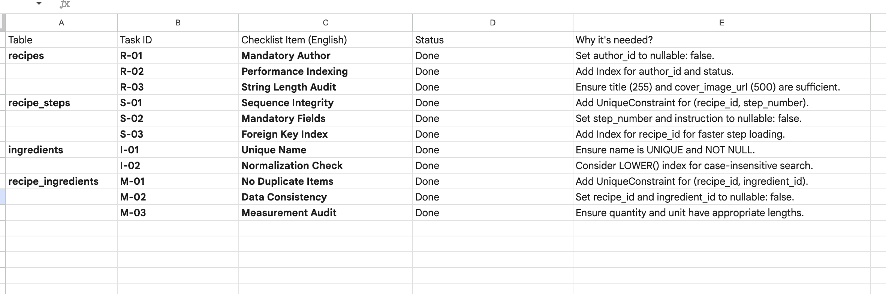
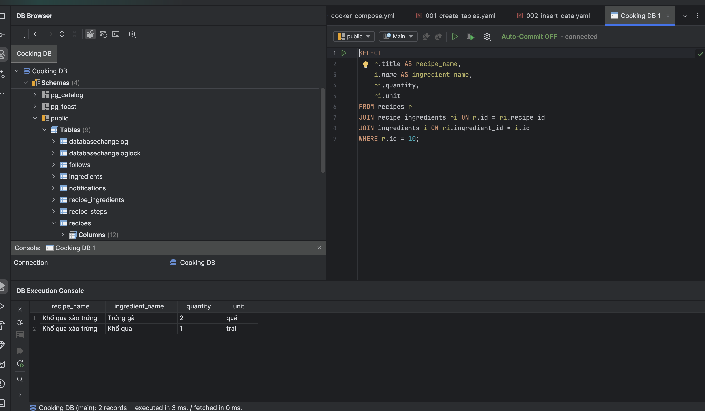
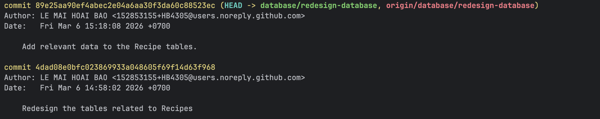

# Weekly Report

## General Information

**Group ID:** 03  
**Project Name:** Yum Recipe  
**Date Range:** 2026-03-01 – 2026-03-07  

## Tasks Completed This Week

### 23127122 - Nguyễn Duy Thịnh
- Initializing Spring Boot server
- Setting up Liquibase database migration

Evidence

### 23127205 - Lâm Hữu Khánh

### 23127326 - Lê Mai Hoài Bảo
- Check and redesign the Recipe tables in the database to ensure they are correct.
- Insert sample data into the tables related to Recipes to facilitate API development.

Evidence

- Because I was initially tasked with creating the Recipe tables in the database, but the database creator had already created them, I will review and redesign them if I find anything illogical.

- After checking and redesigning the tables, I will insert sample data into them to support the development of APIs related to Recipes.

- Commit messages for the above tasks:

### 23127357 - Lê Anh Duy
- Initialize entities.
- Explore which API is most suitable for calculating nutrition => CalorieNinjas API.
- Explore and setup Google Gemini API for AI feature.

## AI Usage Declaration

## Tasks Planned for Next Week

### 23127357 - Lê Anh Duy
- Setup Dependencies Injection.
- Implement AI dish suggestion (backend for sure, frontend if have enough time).

## Issues

