# Weekly Report

## General Information

**Group ID:** 03  
**Project Name:** Yum Recipe  
**Date Range:** 2026-03-15 – 2026-03-21

## Tasks Completed This Week

### 23127122 - Nguyễn Duy Thịnh

### 23127205 - Lâm Hữu Khánh

- Implemented the FE for Login/Signup/Forgot & Reset Password screen
- Designed the Profile Management screen
- Bound Authorize API to the UI

Evidence

- Commit Message:
  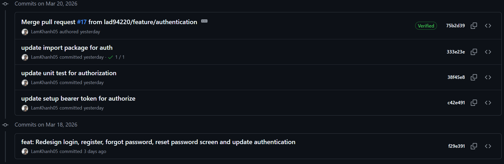
- Design Screens:
  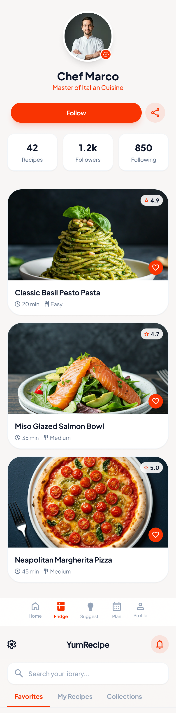
  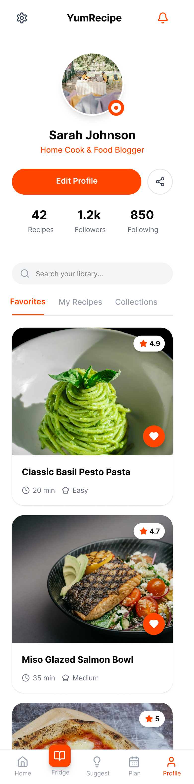
  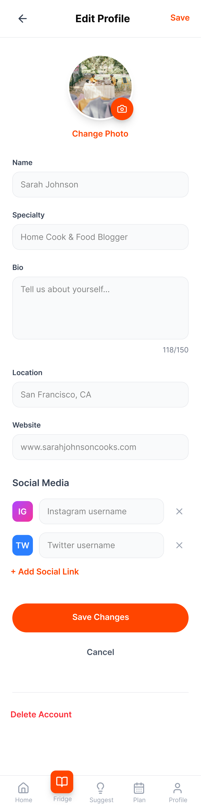

- Final UI Screens:
  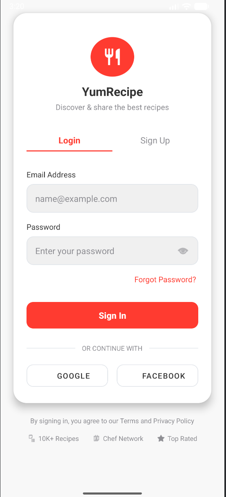
  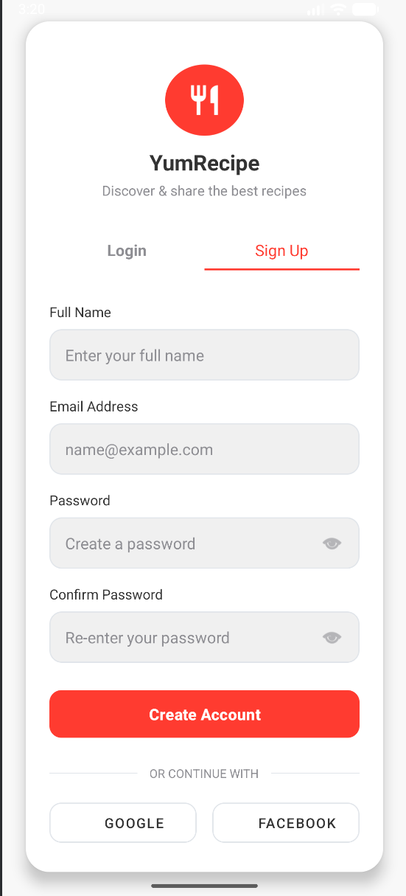
  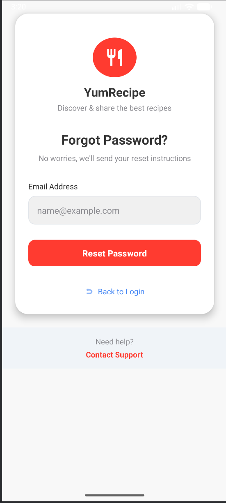

### 23127326 - Lê Mai Hoài Bảo

- Implement the API to create a new recipe.
- Implement the API to edit an existing recipe.
- Implement the API to delete a recipe.
- Design the screen for the recipe details.
- Design the screen for creating and editing a recipe.

Evidence

- API create, edit, delete recipe:
  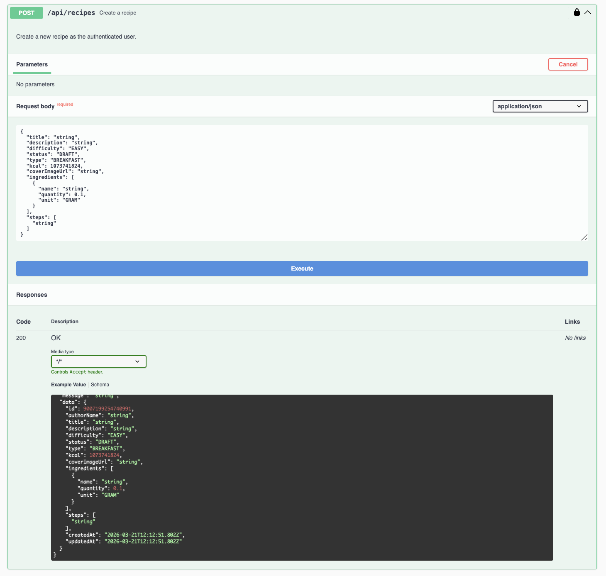
  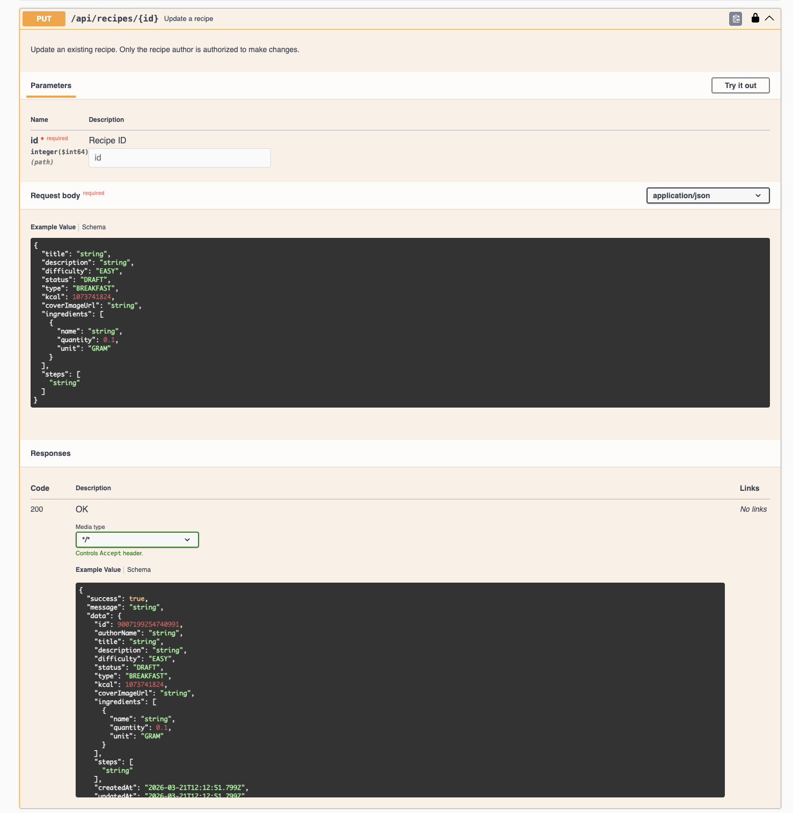
  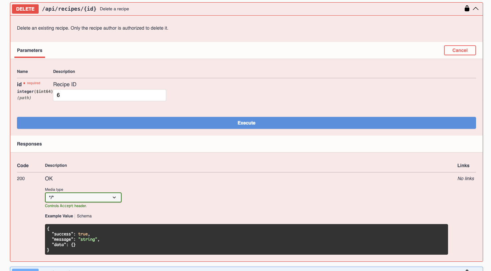
- Design screens:

  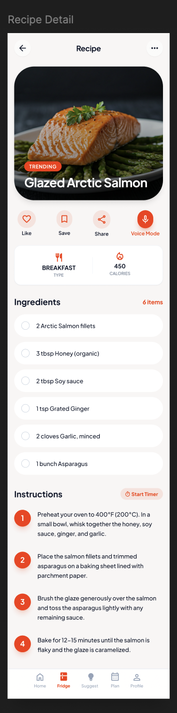

  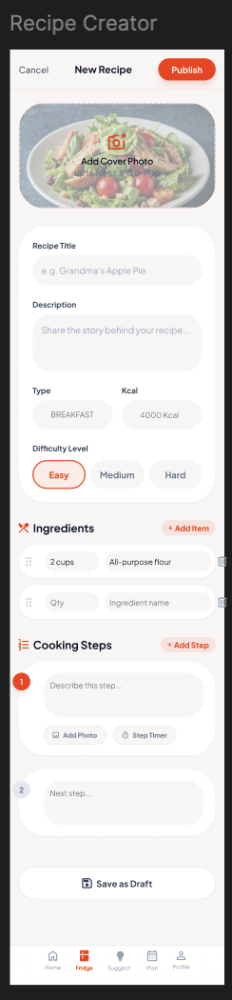

  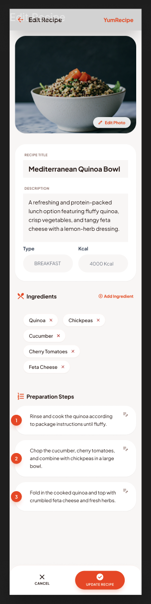
- Commit Message:
  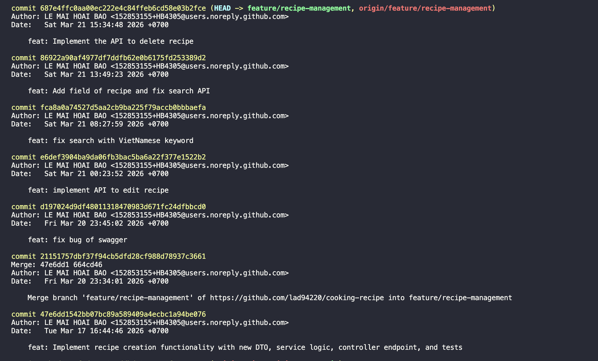

### 23127357 - Lê Anh Duy

- Implement Shopping List.
- Binding Suggestion API to UI.
- Implement Meal Planner UI.
- Implement Cache.

Evidence

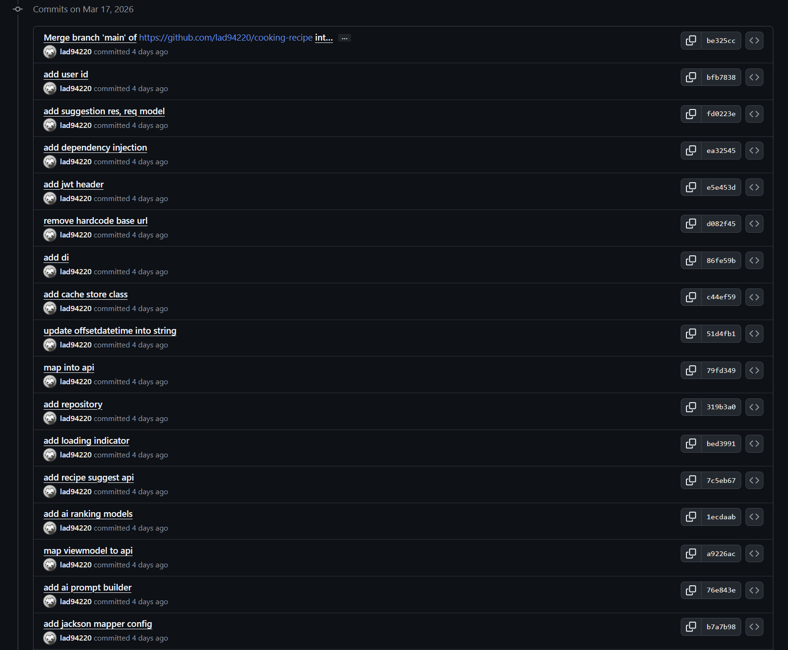
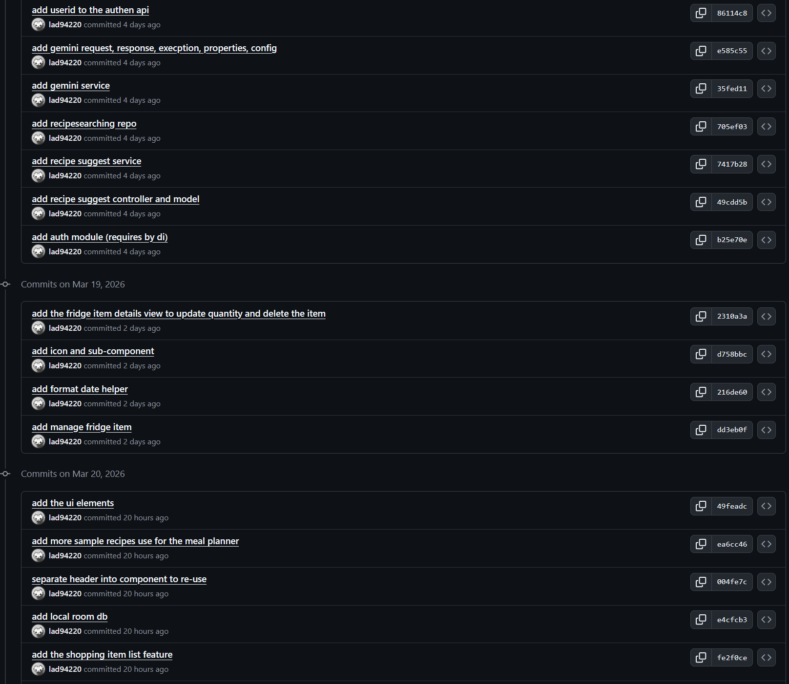
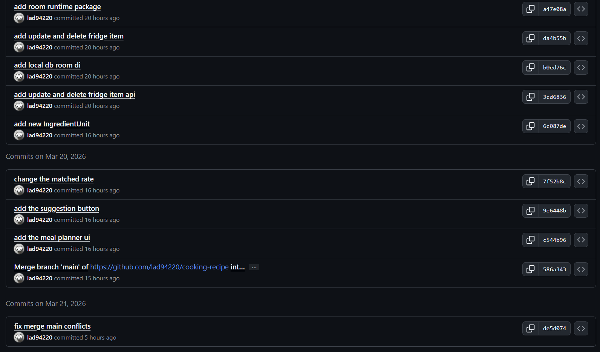

## AI Usage Declaration

### 23127205 - Lâm Hữu Khánh
#### 1. General Information
* **Tool name, version, and platform:** Claude Opus (Anthropic).
* **Access time:** 20:00 March 18, 2026.

#### 2. Usage Details
* **Prompts used:**
    - "Use your all potential to read the structure of this source code carefully, then help me to complete these task:
      - Completed the UI screen (Login/Signup/ForgotPassword)
      - Binding the API to UI
      - Check the security for these API."
* **Purpose of use:** To complete UI screens (Login/Signup/ForgotPassword), bind API to UI, and check security for the APIs.
#### 3. Content Declaration
* **Which content was generated by AI:**
    * `JwtService.java`, `JwtAuthFilter.java`, `SecurityConfig.java` – JWT and Spring Security boilerplate.
    * `AuthDto.java` and all request/response models – DTO boilerplate.
    * `AuthApiService.java` – Retrofit interface boilerplate.
    * `fragment_login.xml`, `fragment_register.xml`, `fragment_forgot_password.xml`, `fragment_reset_password.xml` – UI layout boilerplate with branding and design system.
    * `AuthController.java` – Spring Security controller with email enumeration prevention and SecureRandom OTP generation.
    * `EmailService.java` – Email service boilerplate for password reset.
    * `AuthViewModel.java`, `AuthRepository.java` – ViewModel and Repository boilerplate for API binding.
* **Which content was done independently and how I edited and validated it:**
    * Custom OTP input styling and consistent design system applied to all auth UI layouts.
    * Bound `AuthApiService` to all auth UI components via `AuthViewModel` and `AuthRepository`.
    * Integrated JWT with `EncryptedSharedPreferences` (AES256-GCM) for secure token storage.
    * Added Google OAuth verification logic to `AuthController.java`.
    * Compiled successfully and tested end-to-end authentication flow.

#### 4. Evidence
* **Prompts:** 

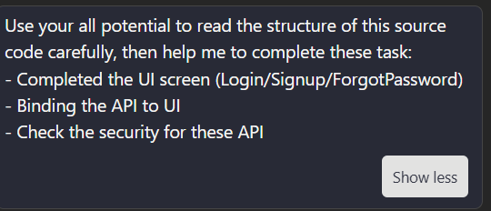

### 23127326 - Lê Mai Hoài Bảo

#### Prompt 1: Implement the API to create a new recipe and create the unit test for it.

##### 1. General Information
* **Tool name, version, and platform:** Gemini 3.1 Pro (Antigravity model), Google, [gemini.google.com](https://gemini.google.com).
* **Access time:** 20:30 on March 18, 2026.

##### 2. Usage Details
* **Prompts used:** "Implement the API to create a new recipe and create the unit test for it.".
* **Purpose of use:** To implement the API for creating a new recipe and to create corresponding unit tests.

##### 3. Content Declaration
* **Which content was generated by AI:**
    * `RecipeController.java` – REST controller with endpoints for creating recipes, including validation and error handling.
    * `RecipeService.java` – Service layer with business logic for recipe creation, including ingredient validation.
    * `CreateRecipeRequest.java` - DTO for recipe creation request.
    * `RecipeControllerTest.java` – JUnit test class with Mockito for unit testing the `RecipeController`.
    * `RecipeServiceTest.java` – JUnit test class with Mockito for unit testing the `RecipeService`.
* **Which content was done independently and how I edited and validated it:**
    * Read and understood the generated code to ensure it met our project requirements and coding standards.
    * Performed integration testing using Swagger UI to verify API functionality and error handling.
    * **Technical Verification:** Executed `./gradelw compileJava` to ensure code compatibility and syntax correctness.

##### 4. Evidence
* **Prompts:** 

  
* **Testing Evidence:** 

  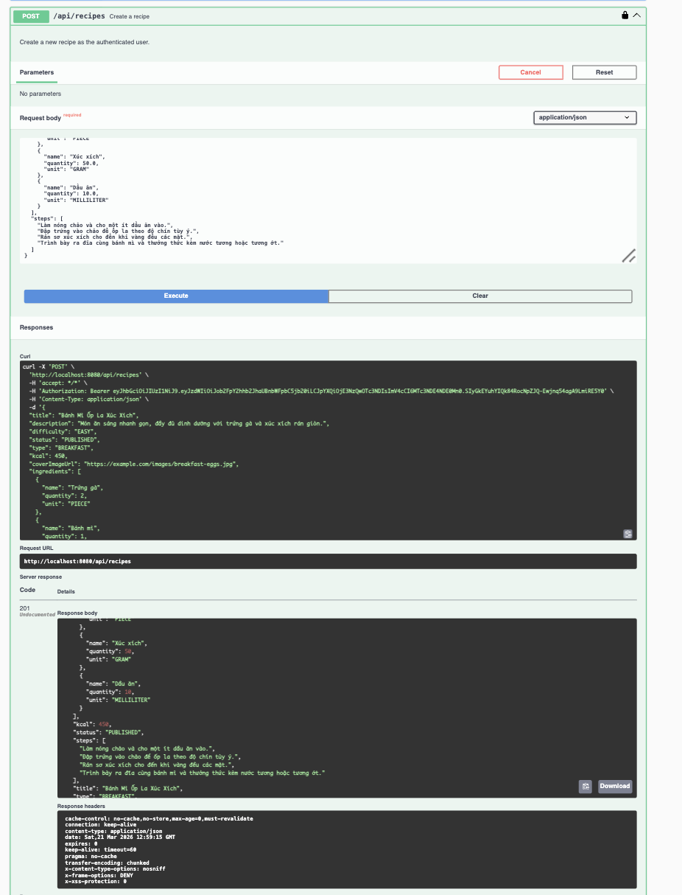
* **Compilation Evidence:**

  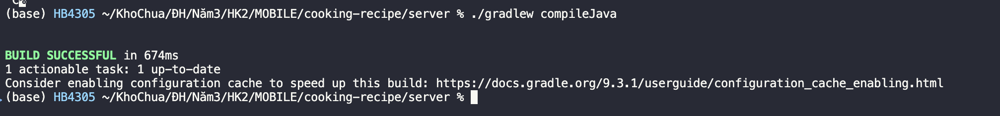

### Prompt 2: Implement the API to edit an existing recipe

##### 1. General Information
* **Tool name, version, and platform:** Claude Opus (Anthropic).
* **Access time:** 13:00 on March 21, 2026.

##### 2. Usage Details
* **Prompts used:** "Implement the API to edit an existing recipe".
* **Purpose of use:** To implement the API for editing an existing recipe.

##### 3. Content Declaration
* **Which content was generated by AI:**
    * `RecipeController.java` – Added endpoint for editing recipes with validation and error handling.
    * `RecipeService.java` – Added business logic for editing recipes, including ingredient validation.
    * `UpdateRecipeRequest.java` - DTO for recipe editing request.
* **Which content was done independently and how I edited and validated it:**
    * Reviewed the generated code to ensure it aligned with our project requirements and coding standards.
    * Performed integration testing using Swagger UI to verify API functionality and error handling.
    * Technical Verification: Executed `./gradelw compileJava` to ensure code compatibility and syntax correctness.
##### 4. Evidence
* **Prompts:**

  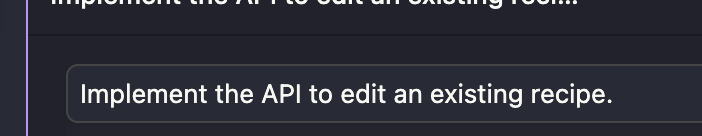
* **Testing Evidence:**
  - Update with full payload:
    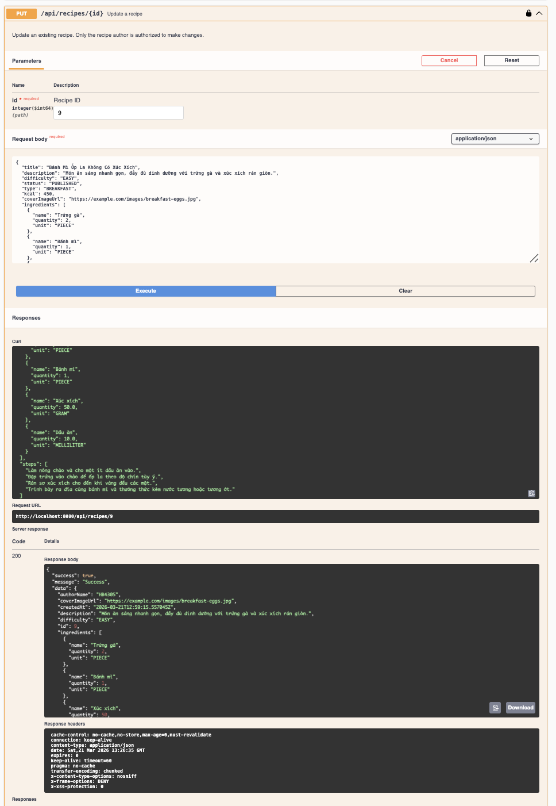
  - Update only the title:
    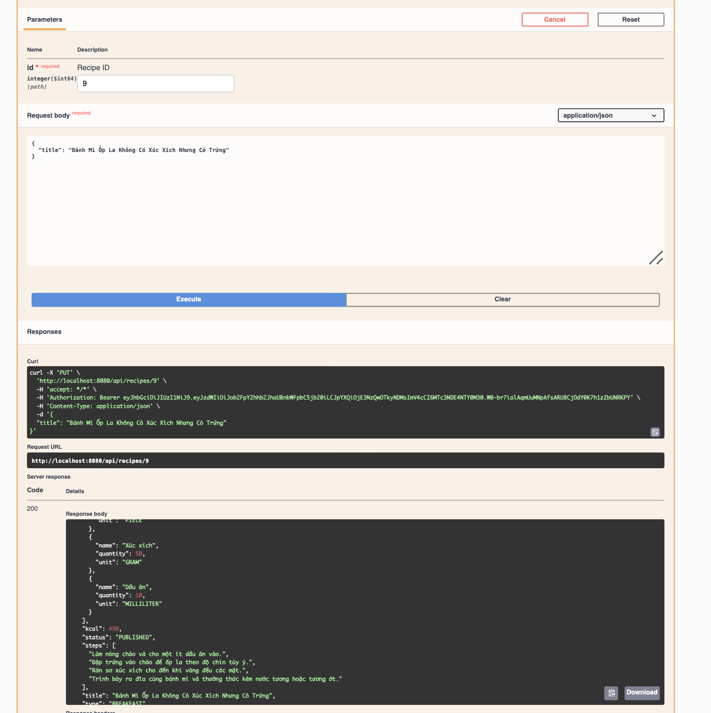
  - Update with Id that does not exist:
    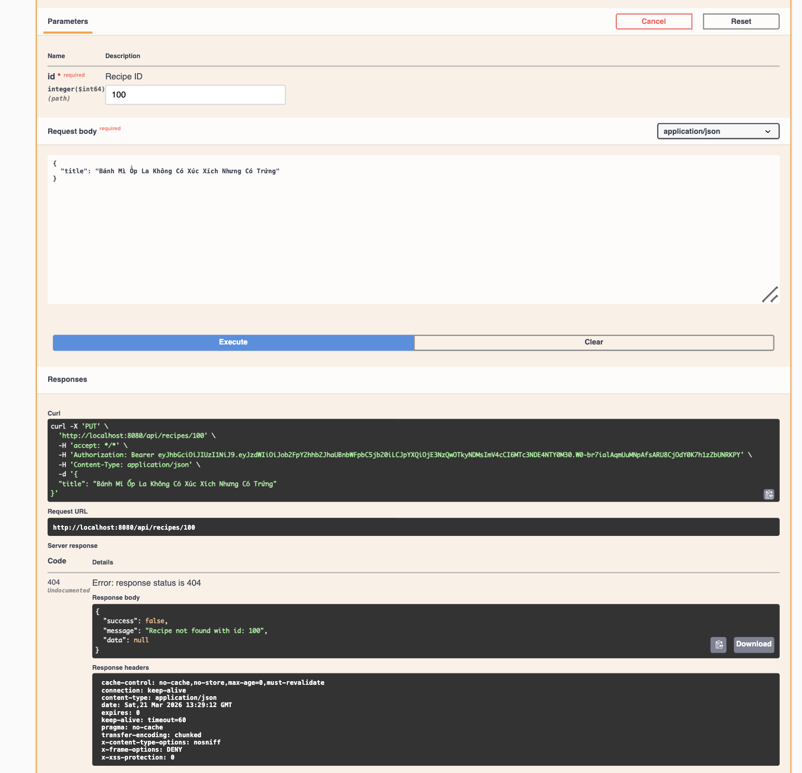
  - Update with recipe is not owned by the user:
    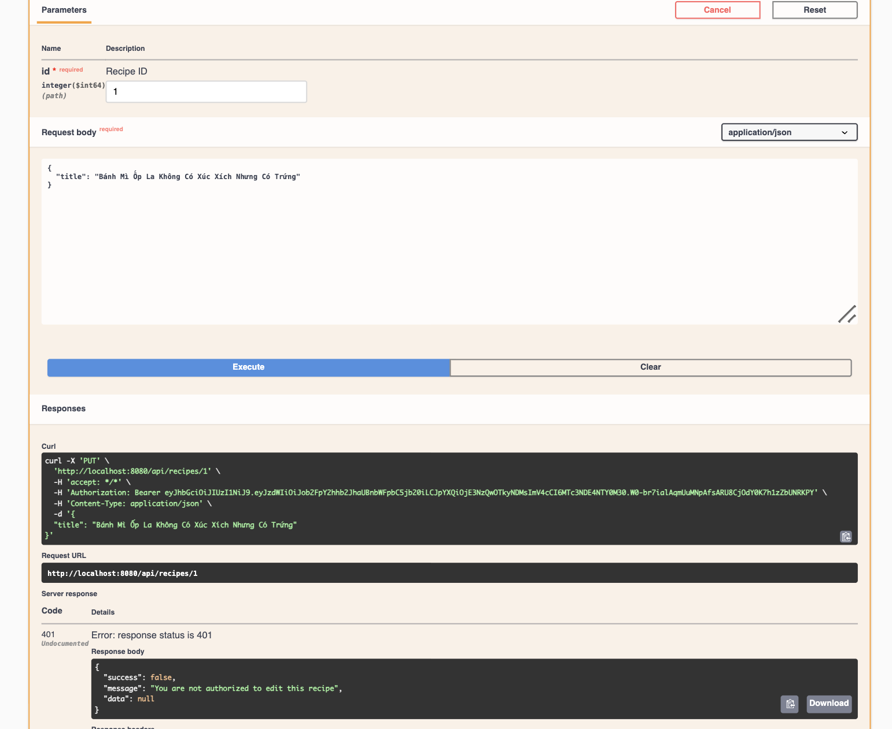
* **Compilation Evidence:**
  

### Prompt 3: Implement the API to delete a recipe
##### 1. General Information
* **Tool name, version, and platform:** Claude Opus (Anthropic).
* **Access time:** 16:00 on March 21, 2026.

##### 2. Usage Details
* **Prompts used:** "Implement the API to delete a recipe".
* **Purpose of use:** To implement the API for deleting a recipe.

##### 3. Content Declaration
* **Which content was generated by AI:**
    * `RecipeController.java` – Added endpoint for deleting recipes with validation and error handling.
    * `RecipeService.java` – Added business logic for deleting recipes, including ownership validation.
* **Which content was done independently and how I edited and validated it:**
    * Reviewed the generated code to ensure it met our project requirements and coding standards.
    * Performed integration testing using Swagger UI to verify API functionality and error handling.
    * Technical Verification: Executed `./gradelw compileJava` to ensure code compatibility and syntax correctness.
##### 4. Evidence
* **Prompts:**

  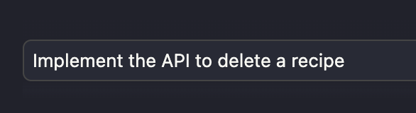
* **Testing Evidence:**
  - Delete with valid Id:
    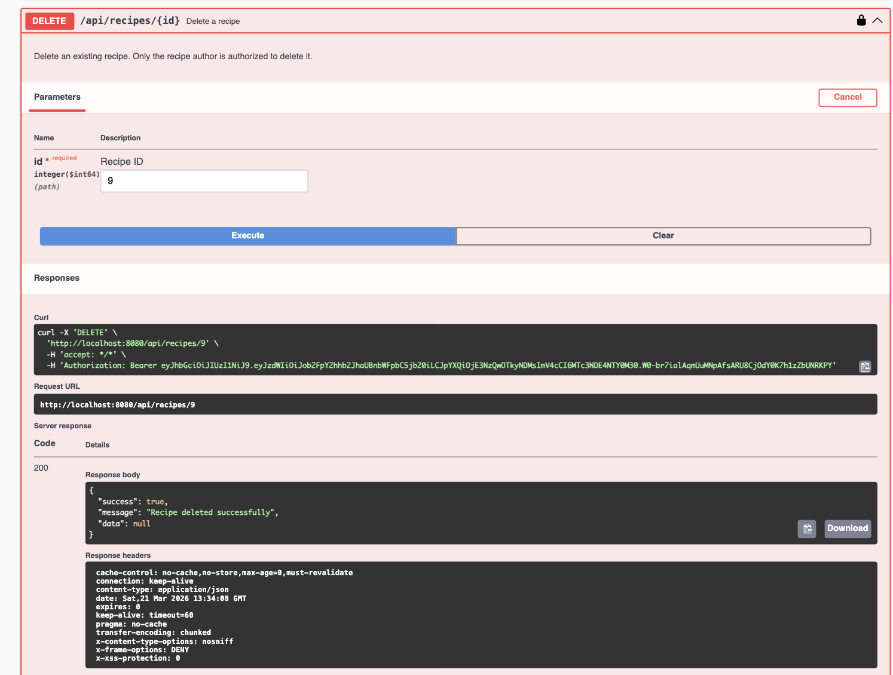
  - Delete with Id that does not exist:
    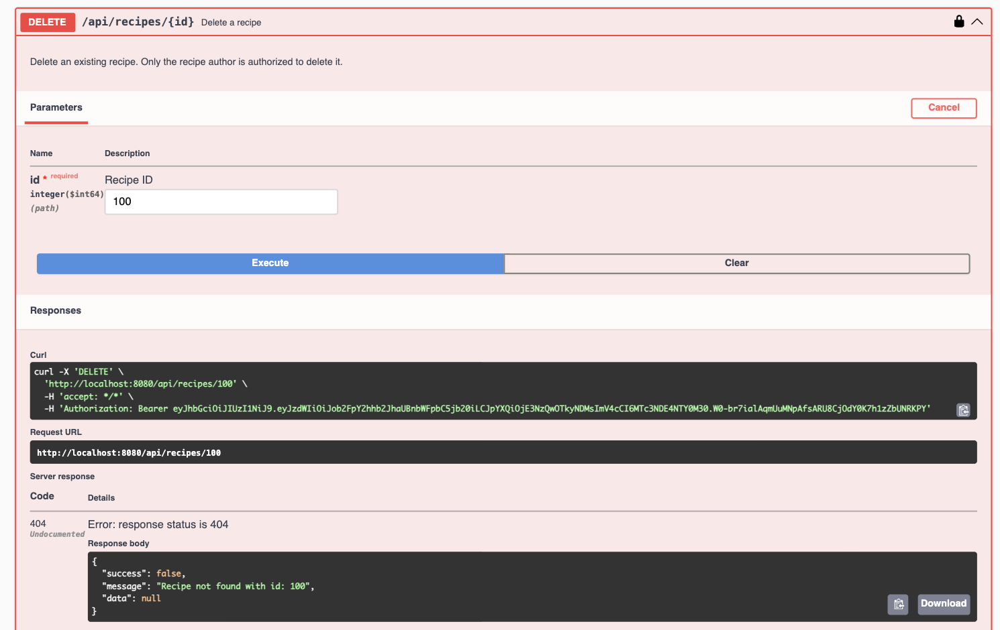
  - Delete with recipe that is not owned by the user:
    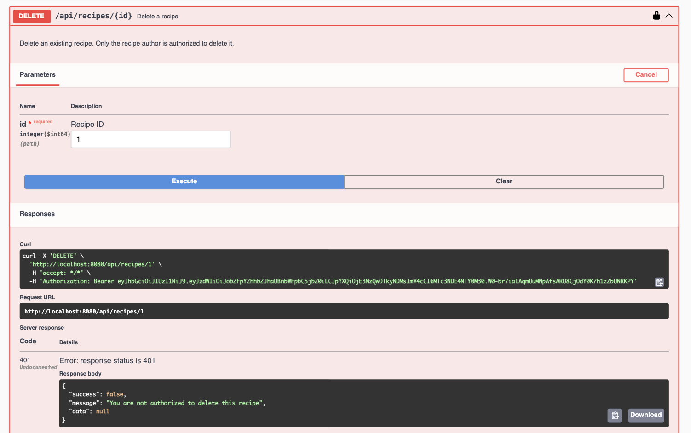
* **Compilation Evidence:**
  

### 23127357 - Lê Anh Duy
#### 1. General Information

- **Tool name, version, and platform:** Gemini 3.1 Pro Preview, ChatGPT 5.1, Stich (Gemini 3.1 Pro Preview), Anthropic Claude Sonet 4.6.
- **Access time:** From 14/03/2026 to 21/03/2026.

#### 2. Usage Details

- **Prompts used:**

* Using to generate UI design and convert from .svg into android .xml.
  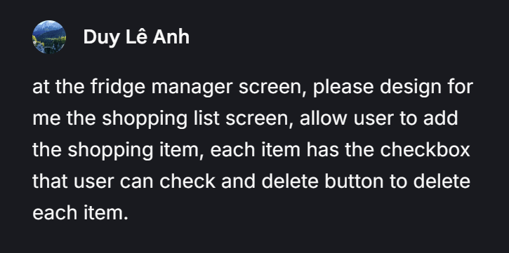
  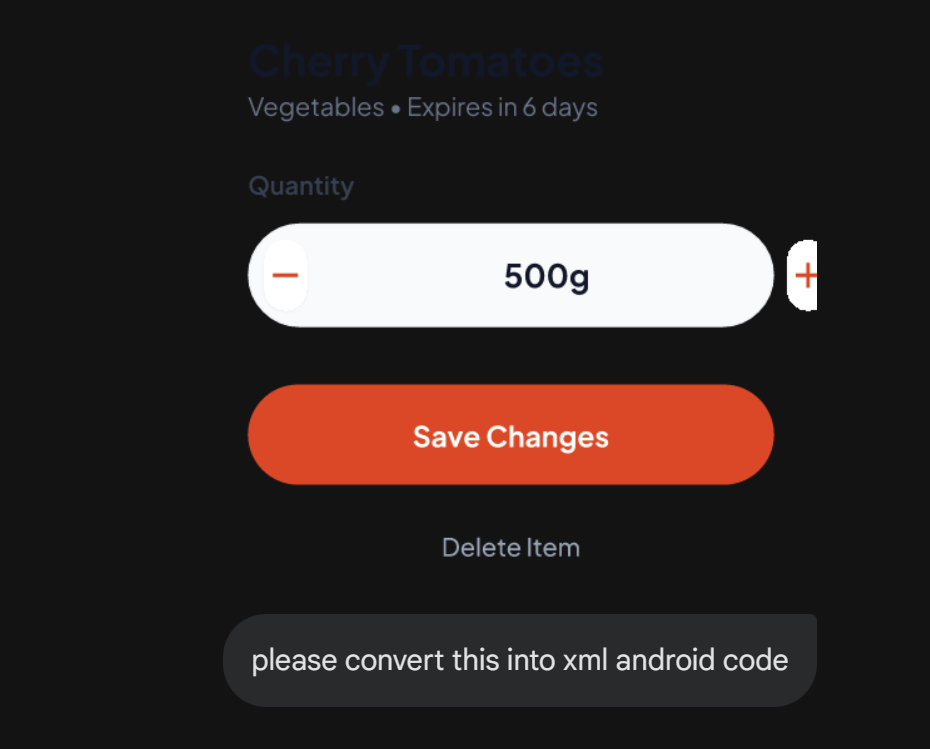
* Using to generate sample data.
  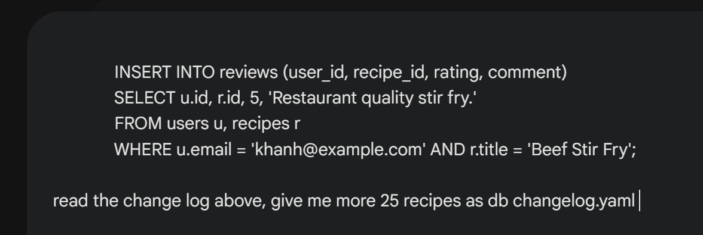
* Create cache and Dependency Injection.
  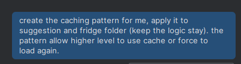

- **Purpose of use:**

* Using to generate mock data automatically.
* Using to code efficiently.

#### 3. Content Declaration

- **Which content was generated by AI:**
  - The UI layout: `component_fridge_item_details.xml`, `component_item_date.xml`, `component_page_header.xml`,
    `component_plan_suggest_item.xml`, `fragment_meal_planner.xml`, `AuthModule.java`, `NetworkModule.java`, `DatabaseModule.java`.

## Tasks Planned for Next Week

### 23127122 - Nguyễn Duy Thịnh

### 23127205 - Lâm Hữu Khánh

- Implement the Profile Management API.
- Implement the Profile Management UI.

### 23127326 - Lê Mai Hoài Bảo

### 23127357 - Lê Anh Duy

- Implement the MealPlanner APIs.
- Add kcal to recipe creation.
- Binding the MealPlanner APIs to the UI.

## Issues
