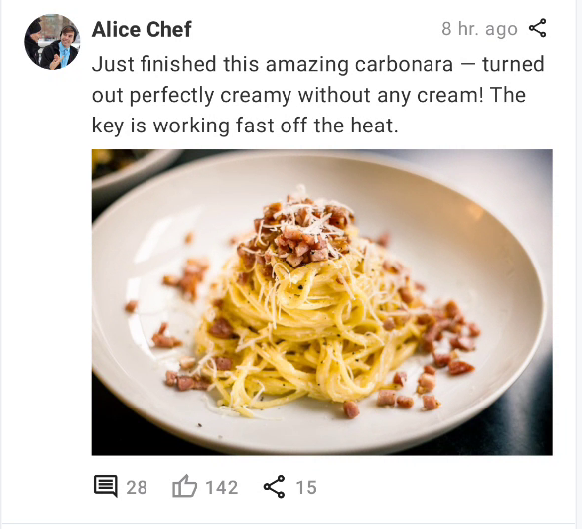
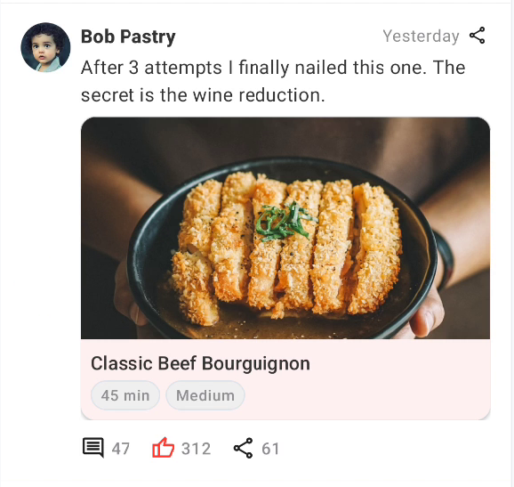
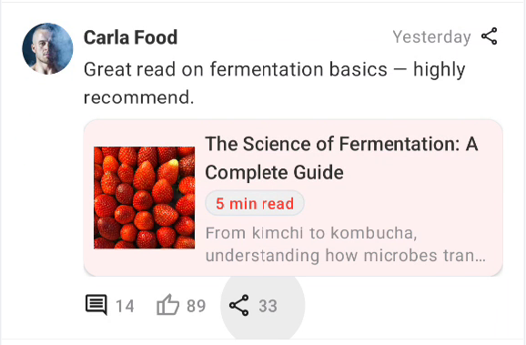
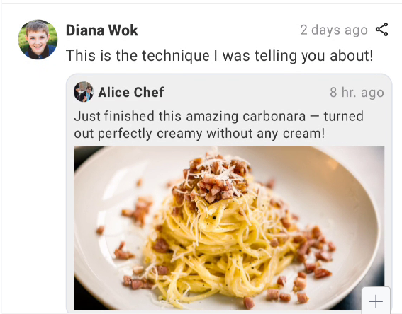
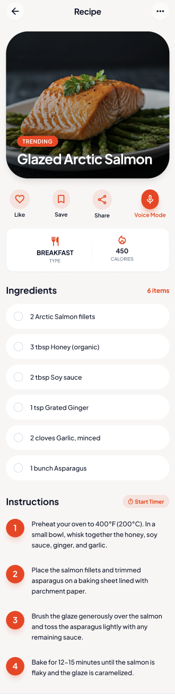
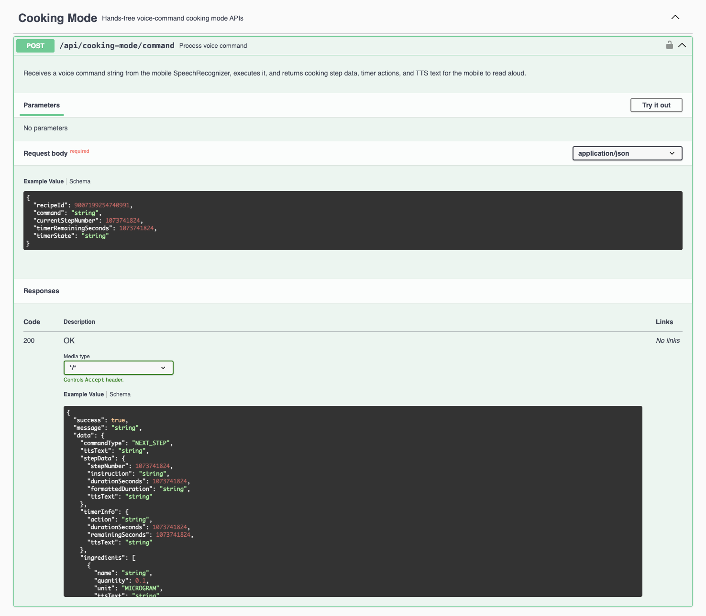
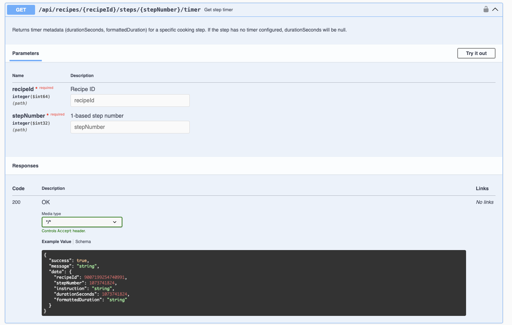
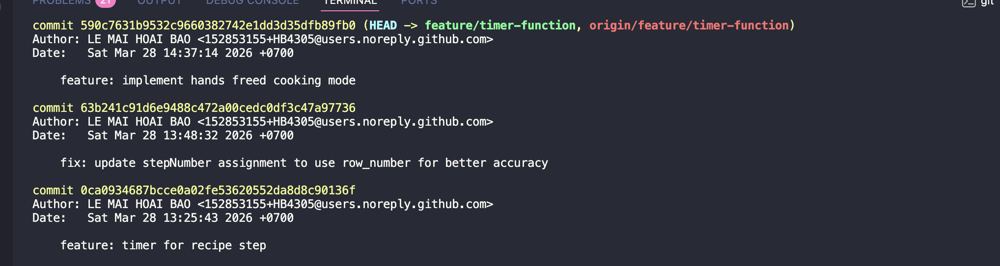
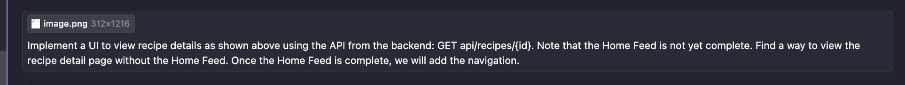
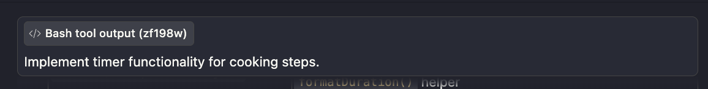

# Weekly Report

## General Information

**Group ID:** 03  
**Project Name:** Yum Recipe  
**Date Range:** 2026-03-22 – 2026-03-28

## Tasks Completed This Week

### 23127122 - Nguyễn Duy Thịnh

- Implemented different UI for posts in home feed (normal post, share other post, share recipe post, share article post).
- Continue working on the server for social features.

Evidence

- Commit Message:
  

- UI fragments:
  

  

  

  

### 23127205 - Lâm Hữu Khánh

- Implemented the UI for the **Other Profile** screen (`ProfileFragment`): displays other user's avatar, bio, follower/following count, and their posted recipes.
- Implemented the UI for the **Own Profile** screen (`ProfileFragment` with ViewPager2 + `ProfileTabAdapter`): tab switching between "My Recipes" and "Saved", shows current user's avatar and edit option.
- Implemented the UI for the **Edit Profile** screen (`EditProfileFragment`); integrated Bottom Sheet for avatar selection from camera or gallery.

Evidence

- Commit Message:
  

- UI Screens:

  

  

  

  

### 23127326 - Lê Mai Hoài Bảo

- Implement the feature to view recipe details (ingredients, quantities, etc.).
- Develop hands-free cooking mode using SpeechRecognizer API.
- Add timer functionality for cooking steps.

View Details

- Implement the feature to view recipe details (ingredients, quantities, etc.).

  
- Develop hands-free cooking mode using SpeechRecognizer API.

  
- Add timer functionality for cooking steps.

  

- Commit messges:
  - "Implemented recipe details view and hands-free cooking mode and timer for cooking steps."

  
  - "Implemented the feature to view recipe details."
  
  

### 23127357 - Lê Anh Duy
- Implemented the UI and API for the Meal Plan feature.
- Implemented the UI and API for the User State feature.
- Add more mock data for Meal Plan.

Evidence

## AI Usage Declaration

### 23127122 - Nguyễn Duy Thịnh
#### 1. General Information
* **Tool name, version, and platform:** Gemini 3.1 Pro.
* **Access time:** March 26 2026.

#### 2. Usage Details
* **Prompts used:**
    - "api design for infinite scroll social feed, I'm working on a spring boot project using rest api"
    - "I need to refactor my UI. Please rewrite `item_feed_post.xml` and create `fragment_post_detail.xml` with these specs:

      1. Feed Style: Use an "X" (Twitter) layout (Avatar on left, content on right).
      2. Post Types: Implement 4 states using ViewStubs or a merging strategy:
         - Normal: Text + optional Image.
         - Shared: A nested "Post within a Post." If a post shares a share, flatten it to show only the original source.
         - Recipe: Card style with Prep Time, Difficulty, and a high-res cover image.
         - Article: Internal content card with a Title, 5-min read badge, and a short snippet.
      3. Detail View: X-style header for the post body.
      4. Comments: 2-level deep nested layout (Facebook/Old YouTube style).

      Please provide the XML and the Java ViewHolder logic to switch between these types based on a 'PostType' enum."
* **Purpose of use:** Create the UI for 4 post types (Normal, Shared, Recipe, Article), find out how to implement the infinite scroll for the social feed.

#### 3. Content Declaration
* **Which content was generated by AI:**
    * `include_post_content_article.xml`, `include_post_content_recipe.xml`, `include_post_content_shared.xml`, `include_post_content_normal.xml` – XML layout boilerplate for each post type.

* **Which content was done independently and how I edited and validated it:**
    * `SocialController.java`, `SocialService.java` (still working)
    * `FollowRepository.java`, `CommentRepository.java`, `PostRepository.java` (still working)
    * Entities/DTOs

#### 4. Evidence
* **Prompts used:**

### 23127205 - Lâm Hữu Khánh
#### 1. General Information
* **Tool name, version, and platform:** Claude Opus 4.6 (Anthropic).
* **Access time:** From 19:00 March 23 to March 28, 2026.

#### 2. Usage Details
* **Prompts used:**
    - "Hãy tưởng tượng bạn là 1 Senior Developer. Hãy đọc về cấu trúc thư mục của source code, về cách tổ chức và thực hiện layout. Từ đó hãy giúp tôi thực hiện các task sau:
      - Thực hiện tạo các giao diện như ảnh 1 (other profile), ảnh 2 (own profile), ảnh 3 (edit profile)"
* **Purpose of use:** Read project structure and design/create the UI for 3 profile screens (Other Profile, Own Profile, Edit Profile).

#### 3. Content Declaration
* **Which content was generated by AI:**
    * `fragment_profile.xml` – XML layout boilerplate for Profile screen (RecyclerView for recipe list, CircleImageView for avatar, TextViews for user info, CardView styling).
    * `fragment_edit_profile.xml` – XML layout boilerplate for Edit Profile screen (TextInputLayouts for form fields, CircleImageView for editable avatar).
    * `bottom_sheet_avatar_picker.xml` – Bottom Sheet layout boilerplate with camera and gallery options.
    * `ProfileFragment.java` – Fragment boilerplate with ViewBinding, lifecycle setup, and RecyclerView initialization.
    * `EditProfileFragment.java` – Fragment boilerplate with ViewBinding and form field references.

* **Which content was done independently and how I edited and validated it:**
    * Implemented Bottom Sheet avatar picker using `Activity Result API` (`registerForActivityResult`) with camera `Intent` and gallery picker in `EditProfileFragment`.
    * Integrated `ProfileTabAdapter` (ViewPager2) for Own Profile screen with two tabs: "My Recipes" and "Saved".
    * Customized fragment layouts to match the dark/navy theme used in other screens of the app.

#### 4. Evidence
* **Prompts used:**

### 23127326 - Lê Mai Hoài Bảo

#### Prompt 1: "Implement the feature to view recipe details (ingredients, quantities, etc.)"

##### 1. General Information
* **Tool name, version, and platform:** Claude Opus (Anthropic).
* **Access time:** 17:00 March 28, 2026.

##### 2. Usage Details
* **Prompts used:** Implement a UI to view recipe details as shown above using the API from the backend: GET api/recipes/{id}. Note that the Home Feed is not yet complete. Find a way to view the recipe detail page without the Home Feed. Once the Home Feed is complete, we will add the navigation.

##### 3. Content Declaration
* **Which content was generated by AI:**
    * **DTO / Model Layer:** `RecipeDetailResponse.java` – wraps API response (`success`, `message`, `data`); `RecipeDetail.java` – recipe model (title, author, difficulty, kcal, cover image, ingredients, steps); `Ingredient.java` – ingredient with quantity + unit formatting; `CookingStep.java` – step with `stepNumber`, `instruction`, `durationSeconds`, `imageUrl`; `RecipeType.java` – meal type enum (breakfast, lunch, etc.).
    * **Data Layer:** `RecipeDetailRepository.java` – fetches from `GET /api/recipes/{id}`, caches result in `MemoryCacheStore`.
    * **Presentation Layer:** `RecipeDetailViewModel.java` – MVVM with `LiveData<RecipeDetail>`, `LiveData<Boolean>` loading, `LiveData<String>` error; `RecipeDetailFragment.java` – binds data, handles Like/Save/Share/Voice Mode, navigates back; `IngredientAdapter.java` – checkboxable ingredient list adapter; `InstructionAdapter.java` – numbered steps with timer pill buttons.
    * **Layouts:** `fragment_recipe_detail.xml` – full recipe detail UI (hero image → actions → info panel → ingredients → instructions); `item_ingredient.xml` – checkbox + name row; `item_instruction.xml` – numbered step + timer pill.
    * **Drawables:** `bg_checkbox_circle.xml` – orange outline/checked circle selector; `bg_timer_pill.xml` – orange-tinted pill for timer; `bg_trending_badge.xml` – orange pill badge; `gradient_bottom_dark.xml` – hero image gradient overlay.
    * **Files Modified:** `ApiService.java` – added `GET recipes/{id}` endpoint; `nav_graph.xml` – added `recipeDetailFragment` with `recipeId: long` arg and navigation actions from `feedFragment`, `suggestionFragment`, `mealPlannerFragment`; `MainActivity.java` – hides bottom nav on recipe detail screen; `SuggestRecipeAdapter.java` – added `OnRecipeClickListener`, triggers navigation on item click; `SuggestionRecipe.java` – passes listener, added `navigateToRecipeDetail()` method.

* **Which content was done independently and how I edited and validated it:**
    * Run app and navigate to recipe detail screen via hardcoded recipe ID (since Home Feed is not complete). Verify UI matches design mockup, data loads correctly from API, and interactions (like/save/share/voice mode) work as expected.

##### 4. Evidence
* **Prompts used:**

#### Prompt 2: "Implement timer functionality for cooking steps"

##### 1. General Information
* **Tool name, version, and platform:** Claude Opus (Anthropic).
* **Access time:** 15:00 March 28, 2026.

##### 2. Usage Details
* **Prompts used:** Implement timer functionality for cooking steps.

##### 3. Content Declaration
* **Which content was generated by AI:**
    * **Entity:** `CookingStep.java` – POJO replacing `List<String>` with structured step data (`stepNumber`, `instruction`, `durationSeconds`, `imageUrl`); `StepTimerResponse.java` – response DTO for the timer endpoint, includes `formattedDuration` (e.g. "8 min", "2 min 30 sec").
    * **Database Migration:** `db/changelog/20260328-000000-migrate-steps-to-cooking-step-format.yaml` – one-time migration that auto-converts all existing `["step text", ...]` arrays to the new `[{"stepNumber":1,"instruction":"step text",...}]` format on startup.
    * **Modified Entities/DTOs:** `Recipe.java`, `CreateRecipeRequest.java`, `UpdateRecipeRequest.java`, `RecipeDetailDTO.java` – changed `List<String> steps` → `List<CookingStep> steps`.
    * **Service Layer:** `RecipeService.java` – added `getStepTimer(recipeId, stepNumber)` + `formatDuration()` helper.
    * **Controller:** `RecipeController.java` – added `GET /api/recipes/{recipeId}/steps/{stepNumber}/timer` endpoint.
    * **Mock Data Migration:** `db/changelog/20260308-184700-add-mock-data.yaml` – rewrote all 5 sample recipes with `CookingStep` JSON including realistic `durationSeconds`.

* **Which content was done independently and how I edited and validated it:**
    * Ran the one-time migration on existing database to verify backward compatibility and correct data transformation.
    * Test API endpoint with Postman to ensure correct timer formatting based on `durationSeconds` (e.g. 480 → "8 min", 150 → "2 min 30 sec").
##### 4. Evidence
* **Prompts used:**

#### Prompt 3: "Develop hands-free cooking mode using SpeechRecognizer API"
##### 1. General Information
* **Tool name, version, and platform:** Claude Opus (Anthropic).
* **Access time:** 16:00 March 28, 2026.

##### 2. Usage Details
* **Prompts used:** Implement hands-free cooking mode using SpeechRecognizer API in Backend
##### 3. Content Declaration
* **Which content was generated by AI:**
    * Entity/Enum: `VoiceCommandType.java` – enum with 11 command intents (`NEXT_STEP`, `TIMER_START`, `READ_INGREDIENTS`, etc.).
    * Request DTO: `VoiceCommandRequest.java` – request DTO with `recipeId`, `raw command`, `currentStepNumber`, `timer state`.
    * Response DTOs: `IngredientDTO.java` – ingredient DTO with `ttsText` builder (e.g. "2 cloves of garlic"); `CookingStepDTO.java` – step DTO with `ttsText` (e.g. "Step 3. Fry the onions for 8 minutes."); `TimerDTO.java` – timer action DTO: `START/PAUSE/RESUME/STOP` with seconds and TTS text; `CookingModeResponse.java` – unified response with `ttsText`, `stepData`, `timerInfo`, `ingredients`, etc.
    * Service Layer: `CookingModeService.java` – interface with `processCommand()`, `parseCommand()`; `CookingModeServiceImpl.java` – full implementation: keyword matching, step navigation, timer handling, ingredient queries.
    * Controller: `CookingModeController.java` – REST controller with Swagger `@Tag` + `@Operation` docs; endpoint `POST /api/cooking-mode/command` (JWT-authenticated, requires valid `recipeId`).

* **Which content was done independently and how I edited and validated it:**
    * Tested the endpoint with swagger-ui using various voice commands (e.g. "next step", "start timer", "read ingredients") to verify correct intent parsing and TTS response generation.

##### 4. Evidence
* **Prompts used:**

### 23127357 - Lê Anh Duy
#### 1. General Information

- **Tool name, version, and platform:** Gemini 3.1 Pro Preview, ChatGPT 5.1, Anthropic Claude Sonet 4.6
- **Access time:** From 22/03/2026 to 28/03/2026.

#### 2. Usage Details
- **Purpose of use:**
  - To generate the mock data.
  - To fix the authentication repository error.
  - To generate the UI layout for the Meal Plan and User State features.

  
  
#### 3. Content Declaration

- **Which content was generated by AI:**
  - The UI layout: `fragment_user_stat_setup.xml`, `UserStatSetupFragment.java`, `UserStatSetupViewModel.java`.
  - The mock data for Meal Plan.
  - The fix for the authentication repository error.

## Tasks Planned for Next Week

### 23127122 - Nguyễn Duy Thịnh

- Finish implementing feature group for social feed.
- Implement feature group for artical creation and sharing.
  
### 23127205 - Lâm Hữu Khánh

- Implement API for Edit personal information.
- Binding the API Profile to UI
- Implement API for Notification
### 23127326 - Lê Mai Hoài Bảo

- Implement UI for create recipe.
- Implement UI for edit recipe.
- Implement UI for delete recipe.
- Implement UI for search results.
### 23127357 - Lê Anh Duy
## Issues
