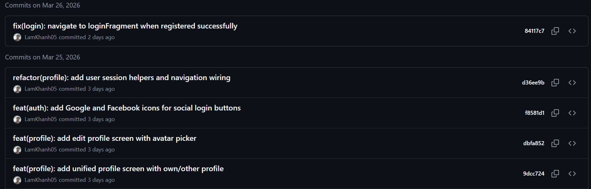
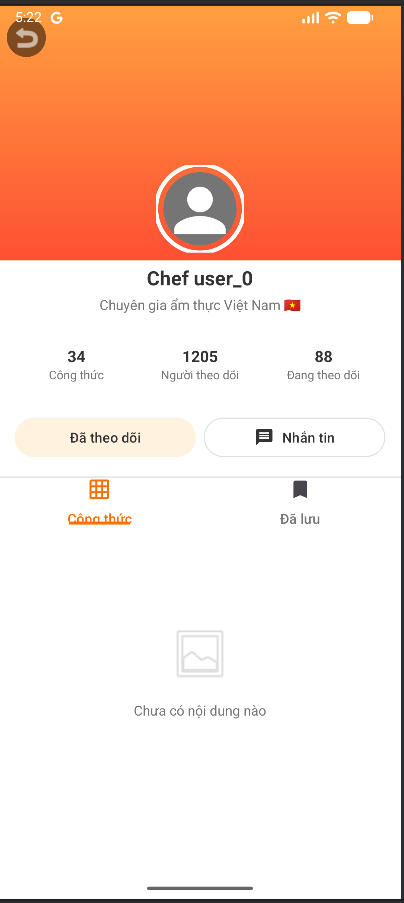
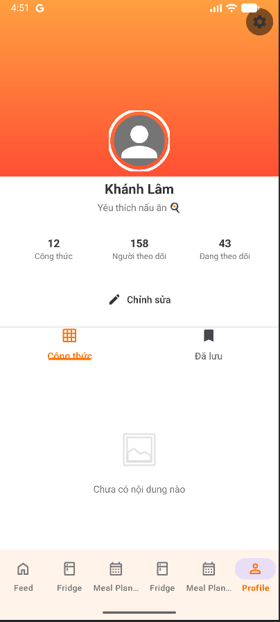
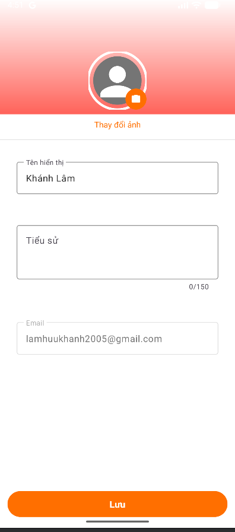
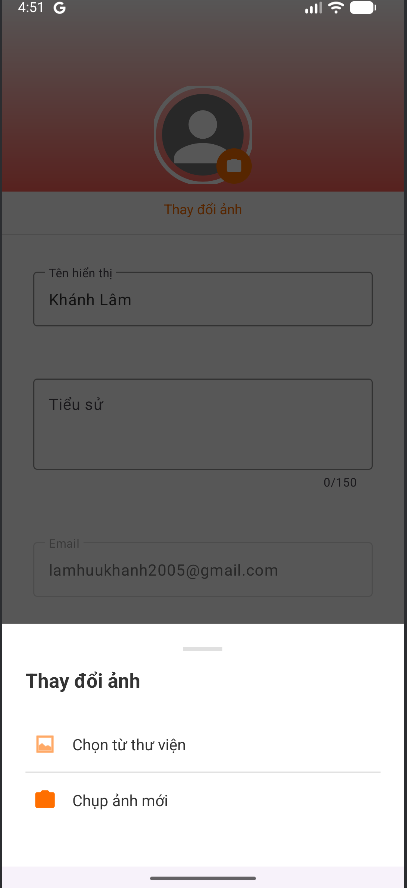
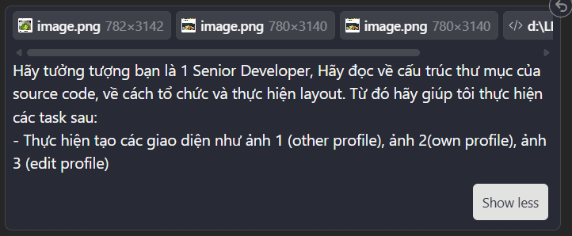

# Weekly Report

## General Information

**Group ID:** 03  
**Project Name:** Yum Recipe  
**Date Range:** 2026-03-22 – 2026-03-28

## Tasks Completed This Week

### 23127122 - Nguyễn Duy Thịnh
### 23127205 - Lâm Hữu Khánh

- Implemented the UI for the **Other Profile** screen (`ProfileFragment`): displays other user's avatar, bio, follower/following count, and their posted recipes.
- Implemented the UI for the **Own Profile** screen (`ProfileFragment` with ViewPager2 + `ProfileTabAdapter`): tab switching between "My Recipes" and "Saved", shows current user's avatar and edit option.
- Implemented the UI for the **Edit Profile** screen (`EditProfileFragment`); integrated Bottom Sheet for avatar selection from camera or gallery.

Evidence

- Commit Message:
  

- UI Screens:

  

  

  

  

### 23127326 - Lê Mai Hoài Bảo
### 23127357 - Lê Anh Duy
- Implemented the UI and API for the meal plan feature.
- Modified the database schema to accommodate meal plan data.
- Add more mock data for testing the meal plan feature.

## AI Usage Declaration

### 23127122 - Nguyễn Duy Thịnh

### 23127205 - Lâm Hữu Khánh
#### 1. General Information
* **Tool name, version, and platform:** Claude Opus 4.6 (Anthropic).
* **Access time:** From 19:00 March 23 to March 28, 2026.

#### 2. Usage Details
* **Prompts used:**
    - "Hãy tưởng tượng bạn là 1 Senior Developer. Hãy đọc về cấu trúc thư mục của source code, về cách tổ chức và thực hiện layout. Từ đó hãy giúp tôi thực hiện các task sau:
      - Thực hiện tạo các giao diện như ảnh 1 (other profile), ảnh 2 (own profile), ảnh 3 (edit profile)"
* **Purpose of use:** Read project structure and design/create the UI for 3 profile screens (Other Profile, Own Profile, Edit Profile).

#### 3. Content Declaration
* **Which content was generated by AI:**
    * `fragment_profile.xml` – XML layout boilerplate for Profile screen (RecyclerView for recipe list, CircleImageView for avatar, TextViews for user info, CardView styling).
    * `fragment_edit_profile.xml` – XML layout boilerplate for Edit Profile screen (TextInputLayouts for form fields, CircleImageView for editable avatar).
    * `bottom_sheet_avatar_picker.xml` – Bottom Sheet layout boilerplate with camera and gallery options.
    * `ProfileFragment.java` – Fragment boilerplate with ViewBinding, lifecycle setup, and RecyclerView initialization.
    * `EditProfileFragment.java` – Fragment boilerplate with ViewBinding and form field references.

* **Which content was done independently and how I edited and validated it:**
    * Implemented Bottom Sheet avatar picker using `Activity Result API` (`registerForActivityResult`) with camera `Intent` and gallery picker in `EditProfileFragment`.
    * Integrated `ProfileTabAdapter` (ViewPager2) for Own Profile screen with two tabs: "My Recipes" and "Saved".
    * Customized fragment layouts to match the dark/navy theme used in other screens of the app.

#### 4. Evidence
* **Prompts used:**

### 23127326 - Lê Mai Hoài Bảo

### 23127357 - Lê Anh Duy
#### 1. General Information

- **Tool name, version, and platform:** Gemini 3.1 Pro Preview, ChatGPT 5.1, Anthropic Claude Sonet 4.6
- **Access time:** From 14/03/2026 to 21/03/2026.

#### 2. Usage Details

- **Prompts used:**
- **Purpose of use:**
#### 3. Content Declaration

- **Which content was generated by AI:**
  - The UI layout: .

## Tasks Planned for Next Week

### 23127122 - Nguyễn Duy Thịnh
### 23127205 - Lâm Hữu Khánh

- Implement API for Edit personal information.
- Binding the API Profile to UI
- Implement API for Notification
### 23127326 - Lê Mai Hoài Bảo
### 23127357 - Lê Anh Duy
## Issues
