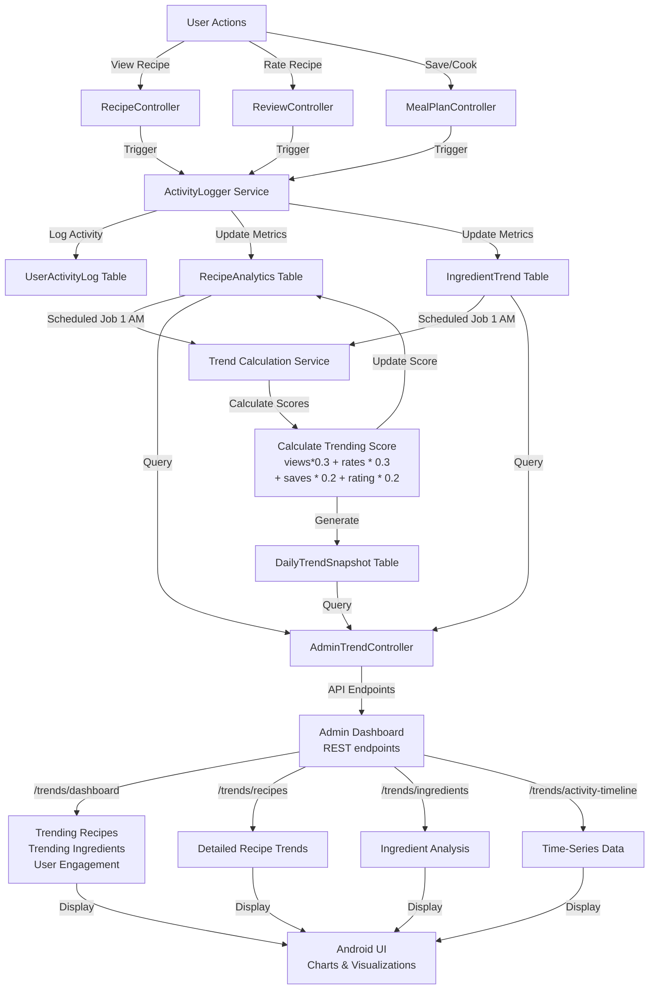
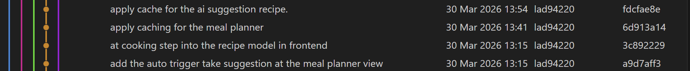
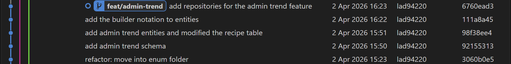
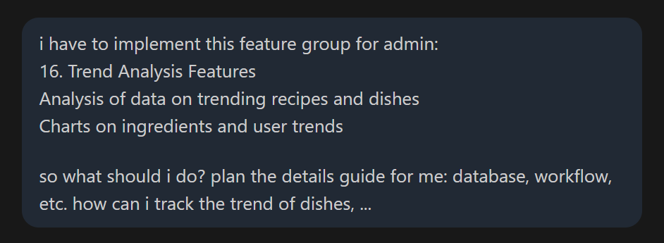
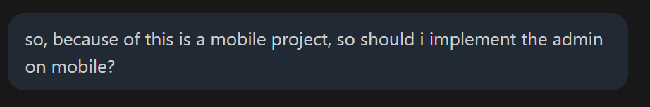
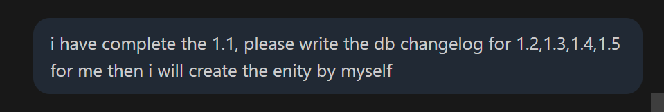
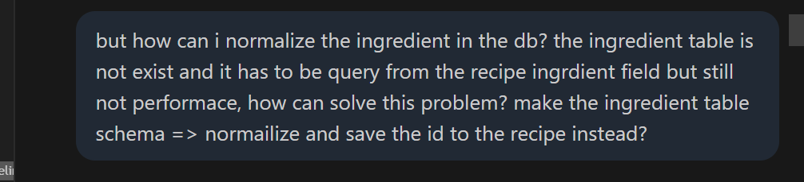
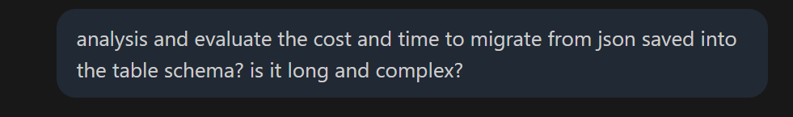
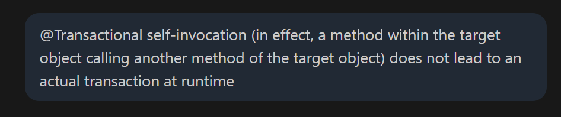

# Weekly Report

## General Information

**Group ID:** 03  
**Project Name:** Yum Recipe  
**Date Range:** 2026-03-29 – 2026-04-04

## Tasks Completed This Week

### 23127122 - Nguyễn Duy Thịnh

Evidence

### 23127205 - Lâm Hữu Khánh

Evidence

### 23127326 - Lê Mai Hoài Bảo

View Details

### 23127357 - Lê Anh Duy
- Finish the implementation of the Meal Plan, Meal Suggestion feature APIs/UI.
- Design the workflow for Admin Analytics and start implementing the backend for it.

Evidence

## AI Usage Declaration

### 23127122 - Nguyễn Duy Thịnh
#### 1. General Information
* **Tool name, version, and platform:** 
* **Access time:** 

#### 2. Usage Details
* **Prompts used:**
* **Purpose of use:** 

#### 3. Content Declaration
* **Which content was generated by AI:**

* **Which content was done independently and how I edited and validated it:**

#### 4. Evidence
* **Prompts used:**

### 23127205 - Lâm Hữu Khánh
#### 1. General Information
* **Tool name, version, and platform:**
* **Access time:**

#### 2. Usage Details
* **Prompts used:**
* **Purpose of use:** 

#### 3. Content Declaration
* **Which content was generated by AI:**
    
* **Which content was done independently and how I edited and validated it:**
 
#### 4. Evidence
* **Prompts used:**

### 23127326 - Lê Mai Hoài Bảo

#### Prompt 1: "Implement the feature to view recipe details (ingredients, quantities, etc.)"

##### 1. General Information
* **Tool name, version, and platform:** 
* **Access time:** 

##### 2. Usage Details
* **Prompts used:** 

##### 3. Content Declaration
* **Which content was generated by AI:**

* **Which content was done independently and how I edited and validated it:**

##### 4. Evidence
* **Prompts used:**

#### Prompt 2: "Implement timer functionality for cooking steps"

##### 1. General Information
* **Tool name, version, and platform:** 
* **Access time:**

##### 2. Usage Details
* **Prompts used:**

##### 3. Content Declaration
* **Which content was generated by AI:**

* **Which content was done independently and how I edited and validated it:**
##### 4. Evidence
* **Prompts used:**

#### Prompt 3: "Develop hands-free cooking mode using SpeechRecognizer API"
##### 1. General Information
* **Tool name, version, and platform:** 
* **Access time:**
##### 2. Usage Details
* **Prompts used:** 
##### 3. Content Declaration
* **Which content was generated by AI:**

* **Which content was done independently and how I edited and validated it:**
##### 4. Evidence
* **Prompts used:**
### 23127357 - Lê Anh Duy
#### 1. General Information

- **Tool name, version, and platform:** Anthropic Claude Sonet 4.6, Codex 5.3
- **Access time:** From 29/03/2026 to 04/04/2026.

#### 2. Usage Details
- **Purpose of use:**
- To help implement the UI for the Meal Plan and Meal Suggestion features.
- To assist, brainstorming the worflows and API design for for Admin Analytics.
- Creating the plan for implementing the backend for Admin Analytics.
- To generate the database schema changelog for the Analytics feature.

Evidence

#### 3. Content Declaration
- **Which content was generated by AI:** `FavoriteRecipeId.java`, `ActivityLoggerPersistence.java`, `20260403-202200-add-table-fav-recipe.yaml`, `20260402-153000-create-recipe-metrics.yaml`, `20260402-153100-create-ingredient-trend.yaml`, `20260402-153200-create-user-activity-log.yaml`,
`20260402-153300-create-daily-trend-snapshot.yaml`, `20260402-153400-alter-recipes-for-trend-fields.yaml`

## Tasks Planned for Next Week

### 23127122 - Nguyễn Duy Thịnh  
### 23127205 - Lâm Hữu Khánh
### 23127326 - Lê Mai Hoài Bảo
### 23127357 - Lê Anh Duy
