# Weekly Report

## General Information

**Group ID:** 03  
**Project Name:** Yum Recipe  
**Date Range:** 2026-03-29 – 2026-04-04

## Tasks Completed This Week

### 23127122 - Nguyễn Duy Thịnh
- Applying Redis for querying posts for the home feed, improving response time and reducing database load.
- Refactor post inheritance structure to support different post types.

Evidence

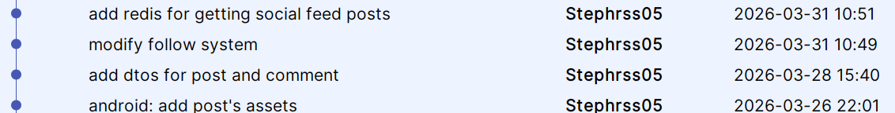

### 23127205 - Lâm Hữu Khánh

- Redesigned Profile screen UI — avatar, stats row, tabs, search bar, button layout
- Implemented Profile backend: `GET/PUT /api/profile/me`, `GET /api/profile/{userId}` with privacy check
- Built Edit Profile screen with avatar picker, bio, location, website, social links
- Added Profile Recipes tab (user's recipe grid) + Favorites/Collections stub tabs

Evidence

- Commit:

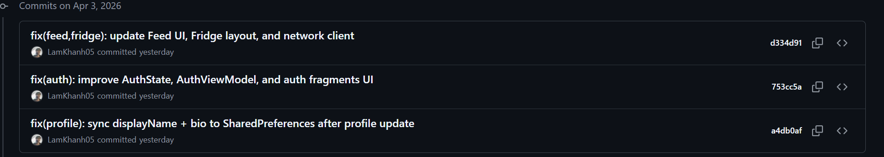
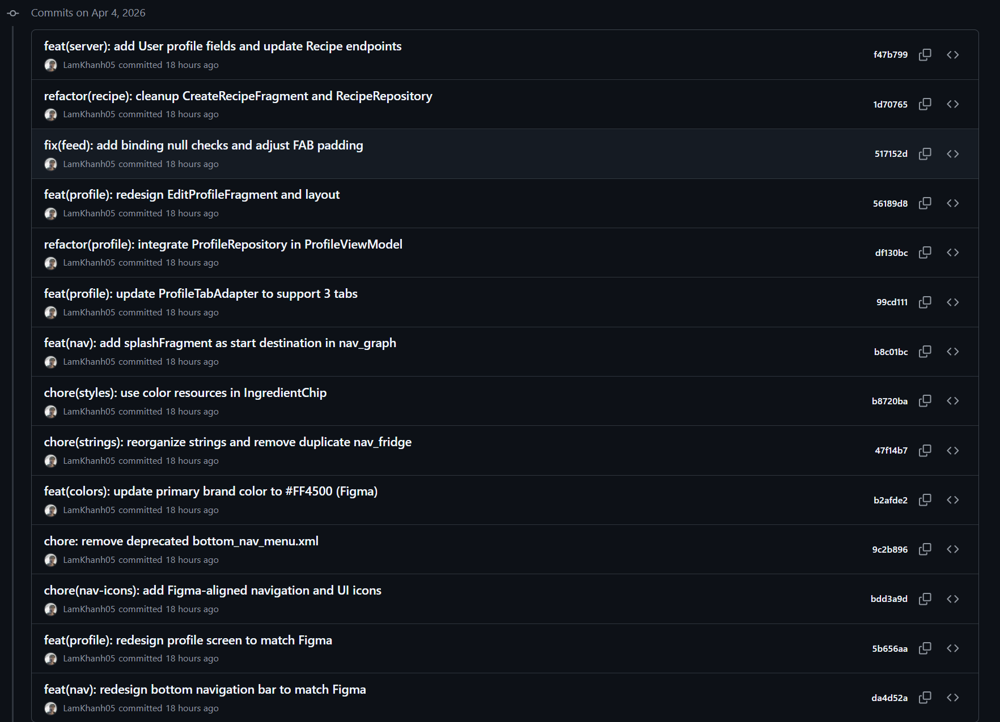

- Redesign Profile:

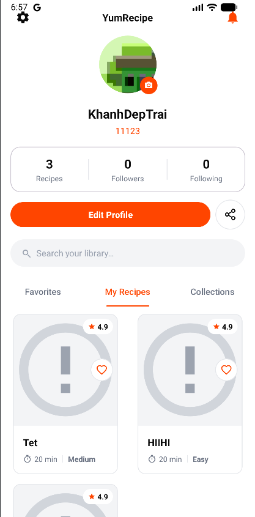

- Get own profile:

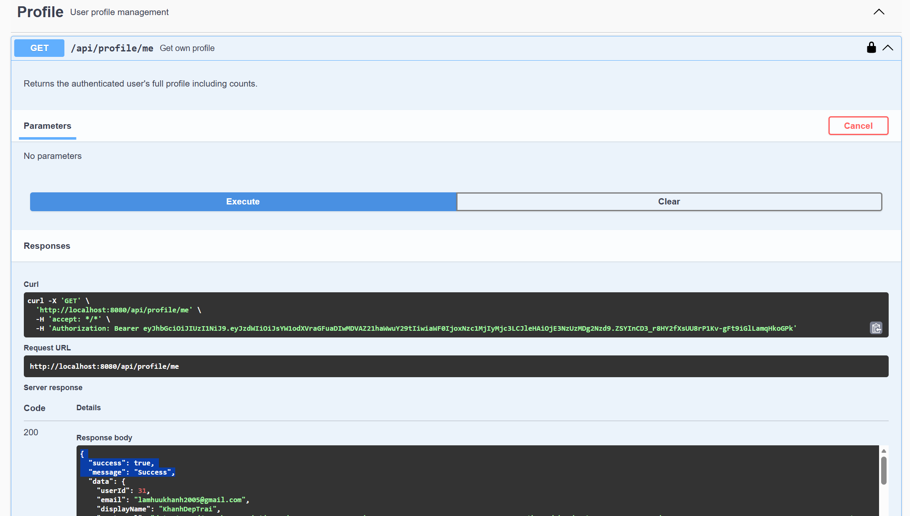

- Update profile:

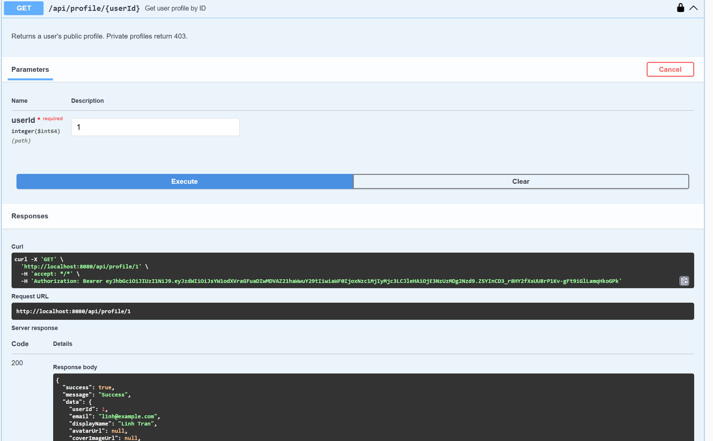

- Get other profile:

### 23127326 - Lê Mai Hoài Bảo
- Implemented UI for create recipe.

View Details

- Button to create recipe in Home Feed. The position of the button is at the bottom right corner of the screen, following the common design pattern for "create" actions in mobile apps. This allows users to easily access the recipe creation feature from the main feed.

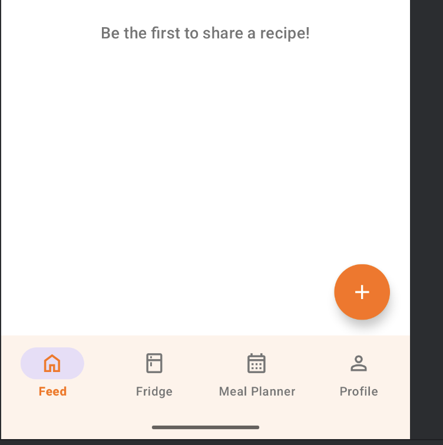

- Screen to input recipe details (title, description, ingredients, steps, image).

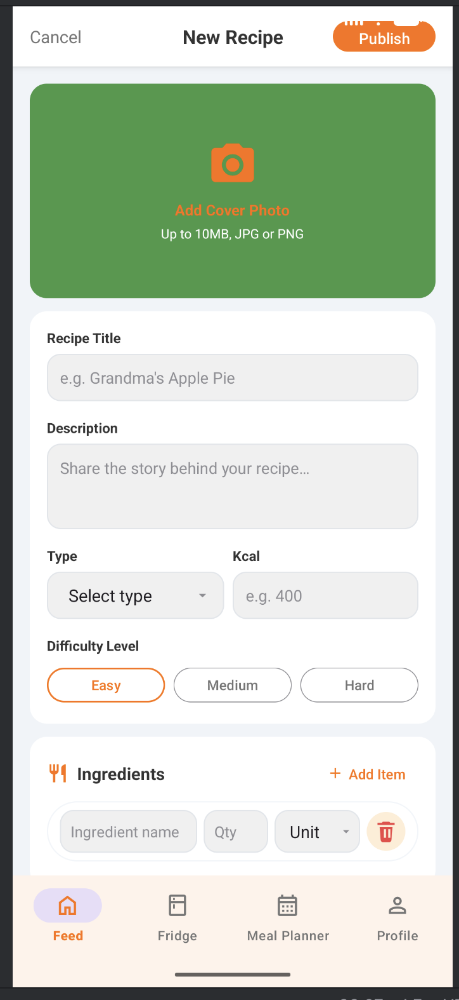

- Commit for create recipe feature implementation.

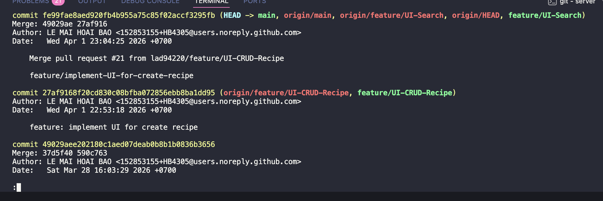

### 23127357 - Lê Anh Duy

- Finish the implementation of the Meal Plan, Meal Suggestion feature APIs/UI.
- Design the workflow for Admin Analytics and start implementing the backend for it.

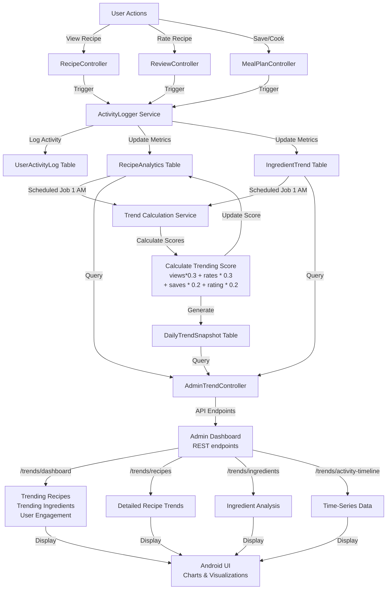

Evidence

## AI Usage Declaration

### 23127122 - Nguyễn Duy Thịnh

#### 1. General Information
* **Tool name, version, and platform:** Anthropic Claude Sonet 4.6
* **Access time:** April 3, 2026

#### 2. Usage Details
* **Purpose of use:** To assist in restructuring communication between Android app and server, generating xml layouts for post details and comments.

#### 3. Content Declaration
* **Which content was generated by AI:** `PostMapper.java`, `fragment_post_detail.xml`, `item_comment.xml`

* **Which content was done independently and how I edited and validated it:** Refactored DTOs for consistency between Android app and server

#### 4. Evidence
* **Prompts used:**

Prompt

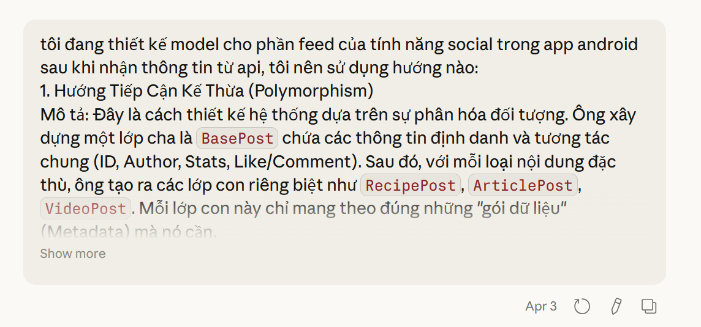

### 23127205 - Lâm Hữu Khánh

##### 1. General Information

- **Tool name, version, and platform:** Claude Opus 4.6 (Anthropic), Claude Code CLI
- **Access time:** From 29/03/2026 to 04/04/2026

##### 2. Usage Details

- **Prompts used:**
  - "Hãy đọc thật kỹ folder @.claude và sau đó hãy hoàn thiện các task sau giúp tôi: - Hoàn tất các Nhóm tính năng quản lý tài khoản - Chỉnh sửa thông tin cá nhân - Cài đặt tài khoản (riêng tư/công khai) - Tùy chỉnh ứng dụng, phần api backend"
  - "Hoàn thiện giao diện other profile thông qua link Figma" (kèm embed iframe Figma)
  - "Hoàn thiện giao diện own profile thông qua link Figma" (kèm embed iframe Figma)
  - "Hoàn thiện giao diện edit profile thông qua link Figma" (kèm embed iframe Figma)
- **Purpose of use:** Read project structure and implement UI/logic for 3 profile screens (Other Profile, Own Profile, Edit Profile), connect Figma designs to Android code, and wire up the Spring Boot backend API endpoints.

##### 3. Content Declaration

- **Which content was generated by AI:**
  - XML layouts: `fragment_profile.xml`, `fragment_edit_profile.xml`, `bottom_sheet_avatar_picker.xml`, `layout_profile_tab_stub.xml`, `component_recipe_grid_item.xml`
  - Java files (Android): `ProfileFragment.java`, `EditProfileFragment.java`, `ProfileViewModel.java`, `ProfileRepository.java`, `ProfileApiService.java`, `ProfileState.java`, `ProfileTabAdapter.java`, `RecipeGridAdapter.java`, `ProfileTabStubFragment.java`
  - Android DTOs: `UserProfileResponse.java`, `UpdateProfileRequest.java`, `ApiResponse.java`, `PageResponse.java`
  - Backend Spring Boot: `ProfileController.java`, `ProfileServiceImpl.java` (interface + implementation), `UserProfileResponse.java`, `UpdateProfileRequest.java` (server-side)
  - Additional backend prompt: modified `ProfileService` to add privacy checks (`isPublic`), separate endpoints for public vs. private profiles.

- **Which content was done independently and how I edited and validated it:**
  - **Activity Result API (camera + gallery):** Independently wrote `ActivityResultLauncher` in `EditProfileFragment` for image selection from gallery and camera capture, with runtime permission handling for CAMERA.
  - **Bottom Sheet Avatar Picker:** Independently implemented `BottomSheetDialog` with `BottomSheetAvatarPickerBinding`, wired listeners for both Gallery and Camera options.
  - **Dual-mode logic in ProfileFragment:** Independently wrote `isOwnProfile` flag logic to display the correct header — own profile shows Settings/Edit/Change Photo buttons, other profiles show Follow/Message/Share buttons.
  - **Avatar bitmap-to-base64 conversion:** Independently wrote `Glide CustomTarget` inside `EditProfileFragment.loadAvatarFromUri()` to encode selected images to data URI format (`data:image/jpeg;base64,...`) before uploading to the server.
  - **TabLayoutMediator + ViewPager2:** Independently connected `TabLayout` with `ViewPager2` via `TabLayoutMediator` in `ProfileFragment.setupTabs()`.
  - **ProfileState sealed class:** Independently designed the `ProfileState` sealed class with states: Idle, Loading, ProfileLoaded, SaveSuccess, FollowToggled, Error — ensuring type-safe UI state observation.
  - **Fallback session data:** In `ProfileViewModel.loadOwnProfile()`, independently wrote fallback logic to use local data from `AuthRepository` (EncryptedSharedPreferences) when the API call fails.
  - **AuthRepository sync:** After `updateProfile` succeeds, independently updated `AuthRepository` (avatar URL, display name, bio) to keep the session in sync.
  - **Privacy toggle (server):** Independently modified `ProfileServiceImpl` — added check for target user's `isPublic` flag; if private and not the owner, throws `ForbiddenException`.
  - **Dark/navy theme matching:** Independently customized all XML layouts to match the app theme (`@color/surface`, `@color/text_primary`, `@color/primary`, `@color/on_primary`).

##### 4. Evidence

- **Prompts used:**

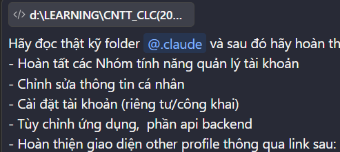

### 23127326 - Lê Mai Hoài Bảo

#### 1. General Information
- **Tool name, version, and platform:** Claude Opus 4.6
- **Access time:** 13:00 02/04/2026

#### 2. Usage Details
- **Prompts used:** My task is to implement the UI for create recipe. I have the images of the interface above; please do the following for me: The first image shows the current feed interface I have; add the button shown in the second image to it. When clicked, that button will lead to the create recipe UI as shown in the third image. The backend has already set up the API for creating recipes; integrate it into the create recipe UI.

- **Purpose of use:** To implement the UI for create recipe and integrate it with the backend API.

#### 3. Content Declaration
- **Which content was generated by AI:**
  - Feed Screen layout (`fragment_feed.xml`): CoordinatorLayout, orange FAB, nav-to-create animation
  - Navigation graph (`nav_graph.xml`): createRecipeFragment destination + action with slide animations
  - Create Recipe UI layout (`fragment_create_recipe.xml`): full form layout matching reference image
  - Item layouts (`item_ingredient_input.xml`, `item_step_input.xml`): reusable dynamic form rows
  - CreateRecipeFragment.java: fragment logic with dynamic form handling, image picker, FAB navigation
  - CreateRecipeViewModel.java: Hilt ViewModel with API integration, validation, loading/error states
  - RecipeRepository.java: singleton repository handling POST /recipes API call
  - Model/DTO classes: CreateRecipeRequest, RecipeResponse, RecipeIngredient, RecipeStep
  - Drawable resources: ic_add, ic_timer, ic_camera, ic_save, ic_steps, ic_ingredients, ic_drag_handle, bg_circle_primary

- **Which content was done independently and how I edited and validated it:** I manually ran the app and tested the create recipe feature to ensure it works correctly. After creating a recipe, I verified the database to confirm the recipe was created with the correct information. I also reviewed all AI-generated code to ensure naming conventions, logic flow, and UI structure matched the existing codebase patterns.

#### 4. Evidence
- **Prompts used:** 

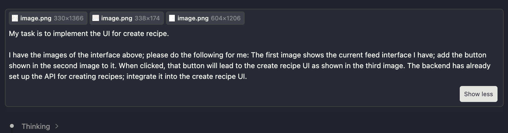

### 23127357 - Lê Anh Duy

#### 1. General Information

- **Tool name, version, and platform:** Anthropic Claude Sonet 4.6, Codex 5.3
- **Access time:** From 29/03/2026 to 04/04/2026.

#### 2. Usage Details

- **Purpose of use:**
- To help implement the UI for the Meal Plan and Meal Suggestion features.
- To assist, brainstorming the worflows and API design for for Admin Analytics.
- Creating the plan for implementing the backend for Admin Analytics.
- To generate the database schema changelog for the Analytics feature.

Evidence

#### 3. Content Declaration

- **Which content was generated by AI:** `FavoriteRecipeId.java`, `ActivityLoggerPersistence.java`, `20260403-202200-add-table-fav-recipe.yaml`, `20260402-153000-create-recipe-metrics.yaml`, `20260402-153100-create-ingredient-trend.yaml`, `20260402-153200-create-user-activity-log.yaml`,
  `20260402-153300-create-daily-trend-snapshot.yaml`, `20260402-153400-alter-recipes-for-trend-fields.yaml`

## Tasks Planned for Next Week

### 23127122 - Nguyễn Duy Thịnh
- Eventually finish the social media feature group.
- Start working on QR generator and scanner.
### 23127205 - Lâm Hữu Khánh

- Complete the API for set profile private/public
- Implement the Notification API

### 23127326 - Lê Mai Hoài Bảo
- Complete UI to Edit, Delete recipe.
- Implement UI for search recipe.
- Implement API for favorites list and collections.
### 23127357 - Lê Anh Duy
