# Weekly Report

## General Information

**Group ID:** 03  
**Project Name:** Yum Recipe  
**Date Range:** 2026-04-05 – 2026-04-11

## Tasks Completed This Week

### 23127122 - Nguyễn Duy Thịnh

### 23127205 - Lâm Hữu Khánh

- Integrate recipe detail navigation from Profile (My Recipes) so users can open full recipe details from their personal recipe list.
- Implement private profile visibility logic with mutual-follow checks to control access to profile information and private recipes.
- Migrate profile image saving flow from Base64 data URI to Cloudinary URL upload (multipart upload + save URL in profile).

Evidence

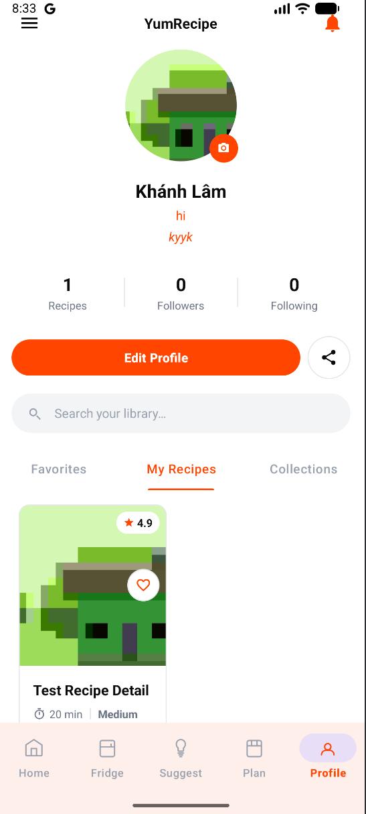

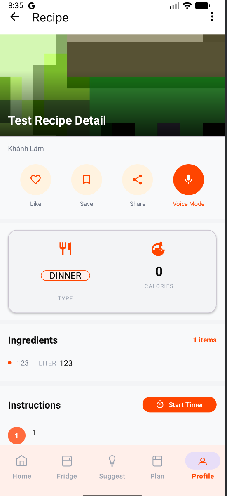

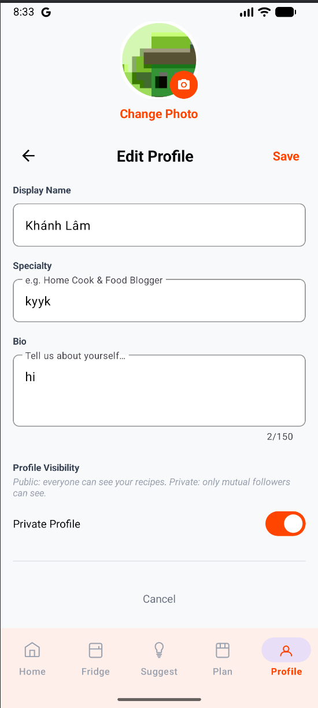

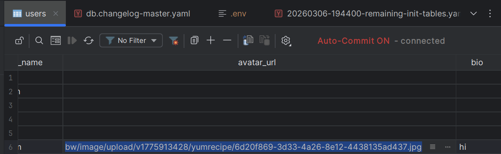

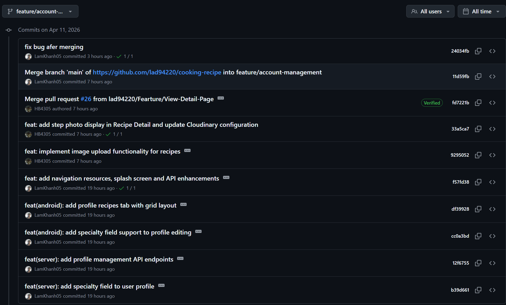

### 23127326 - Lê Mai Hoài Bảo

- Implement a UI for the search function and integrate the API into it.
- Add the Ingredients table to the database for search and filtering purposes.
- Integrate the recipe detail view into the search results page.
- Modify the create recipe to add a timer for each step.
- Setup Cloudinary for image storage and implement image upload functionality in the create recipe page.

Evidence

- UI for search recipe:

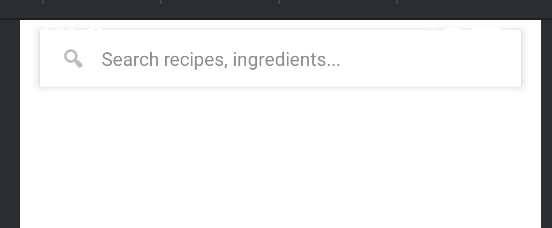

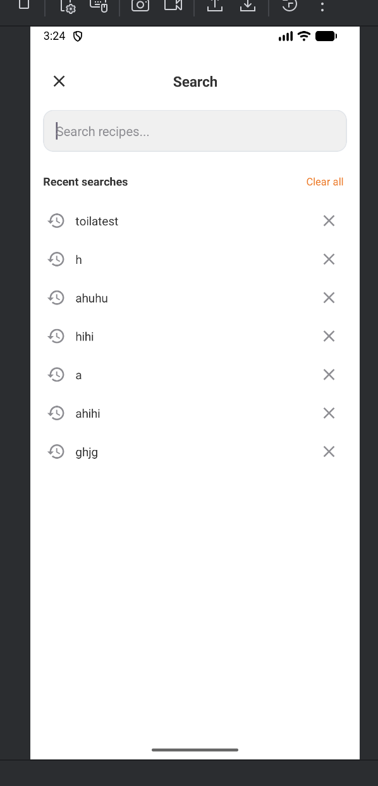

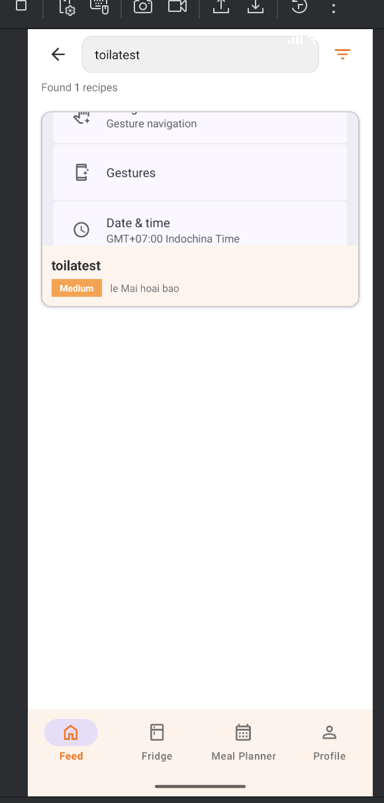

- View recipe detail from search result:

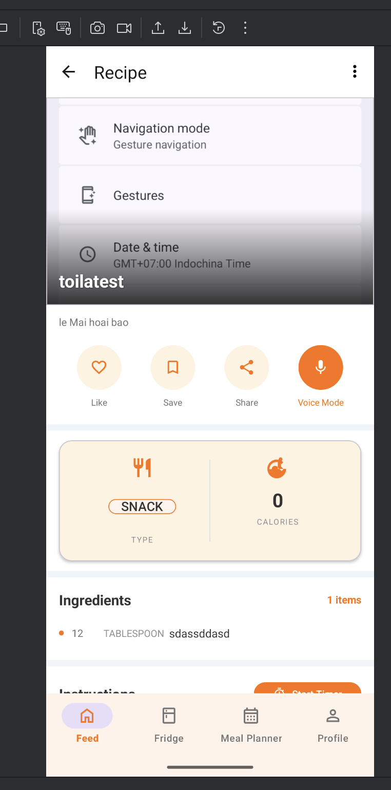

- Add timer for each step in create recipe page:

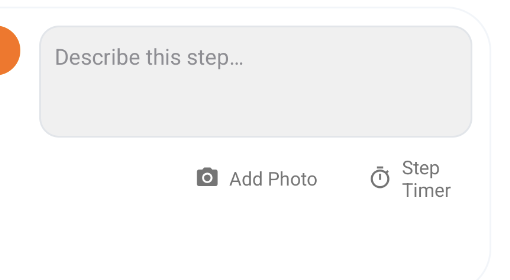

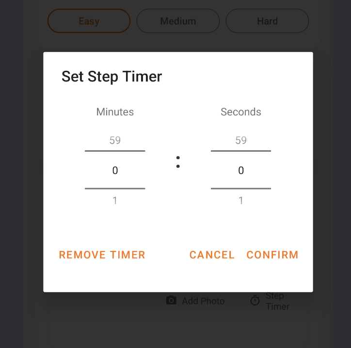

- Commit history:

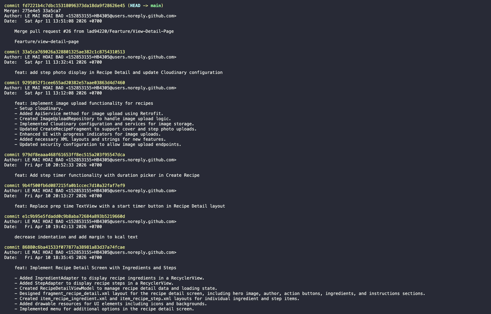

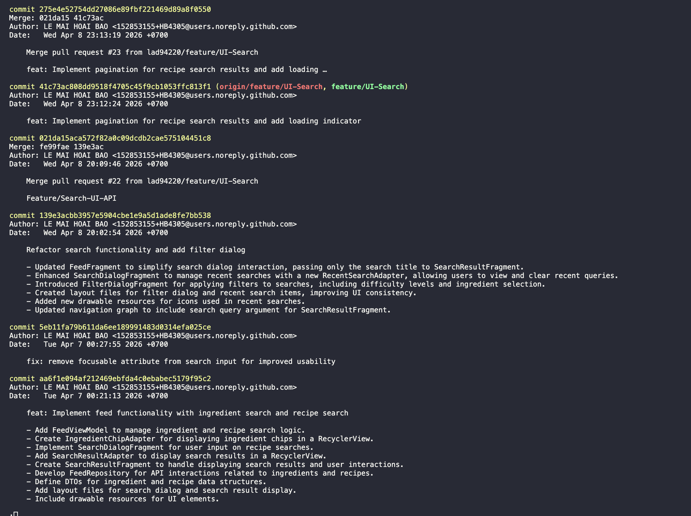

### 23127357 - Lê Anh Duy

## AI Usage Declaration

### 23127122 - Nguyễn Duy Thịnh

### 23127205 - Lâm Hữu Khánh

#### 1. General Information

- **Tool name, version, and platform:** Claude Opus 4.6 (Anthropic)
- **Access time:** 2026-04-06 to 2026-04-11

#### 2. Usage Details

- **Prompt used:** "Hãy giúp tôi thực thi các task sau:
  - Tích hợp get details recipe trong profile để xem recipe của cá nhân.
  - Thêm tính năng profile private để check chỉ khi mutual follow mới có thể xem toàn bộ thông tin
  - Tích hợp việc lưu ảnh thay vì ở base64 thì chuyển sang lưu ở cloudinary."
- **Purpose of use:** To implement profile-related features in Yum Recipe, including recipe detail integration in profile, privacy authorization with mutual-follow logic, and image storage migration from Base64 to Cloudinary.

#### 3. Content Declaration

- **Which content was generated by AI:**
  - Suggested implementation flow and code-level changes for profile recipe detail navigation.
  - Privacy handling updates for private profiles and mutual-follow-based access checks.
  - Refactor guidance for replacing Base64 image payloads with Cloudinary upload URLs.
- **Which content I modified after AI generation:**
  - Adjusted implementation details to fit the current Android and Spring Boot project structure.
  - Verified and refined API integration points, error handling, and navigation behavior in app.

#### 4. Evidence of AI Usage

### 23127326 - Lê Mai Hoài Bảo

#### 1. General Information

- **Tool name, version, and platform:** Claude Opus 4.6
- **Access time:** 2026-04-08 14:30 UTC

#### 2. Usage Details

- **Prompt used:** "ok bây giờ triển khai UI như sau: Thêm 1 thanh search vào dashboard, khi người dùng bấm vào thanh search thì một pop up search sẽ hiện ra, pop up này sẽ có 1 trường title để người dùng nhập và dòng filter theo difficulty và 1 trường để người dùng chọn các ingredient (hiển thị 10 cái thôi sẽ có nút more để load thêm). Khi nhấn tìm kiếm nó sẽ hiện ra search result page. Tôi có giao diện mẫu như hình trên."
- **Purpose of use:** To implement the search function in the Yum Recipe project, including UI design and API integration.

#### 3. Content Declaration

- **Which content was generated by AI:**
  - UI design for the search function, including the search bar, pop-up search interface, and search results page like mockups.
  - API integration logic for the search functionality.
- **Which content I modified after AI generation:**
  - I was test the generated UI and API integration in the project, ensuring it works correctly and meets the requirements.

#### 4. Evidence of AI Usage

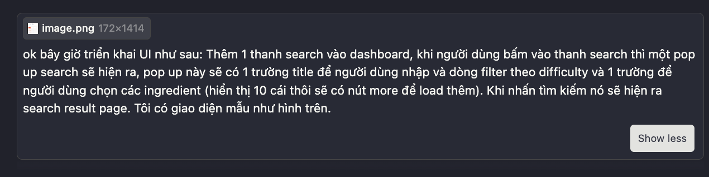

### 23127357 - Lê Anh Duy

## Tasks Planned for Next Week

### 23127122 - Nguyễn Duy Thịnh

### 23127205 - Lâm Hữu Khánh

- Implement notification from app and interact between user and other
- Implement admin for manage account, manage post

### 23127326 - Lê Mai Hoài Bảo

- Integrate Voice mode into the recipe detail view.
- Integrate Timer mode into the recipe detail view.
- Implement API and UI for List favorite recipes.

### 23127357 - Lê Anh Duy
