# Weekly Report

## General Information

**Group ID:** 03  
**Project Name:** Yum Recipe  
**Date Range:** 2026-04-12 – 2026-04-18

## Tasks Completed This Week

### 23127122 - Nguyễn Duy Thịnh
- Finish the feed interaction feature.
- Implement the article creation feature.

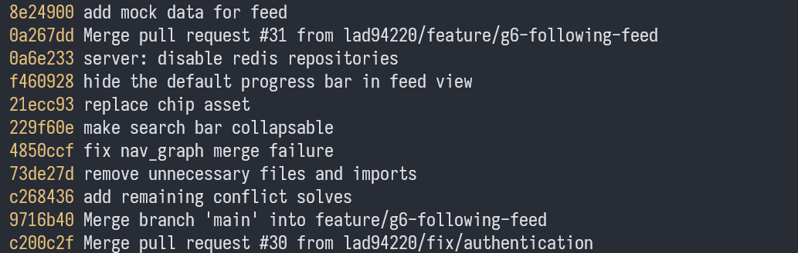
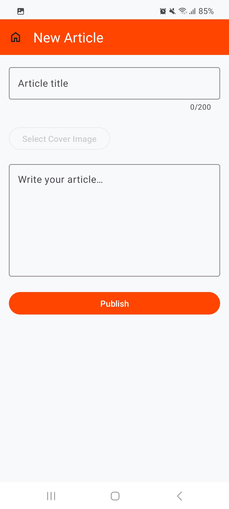
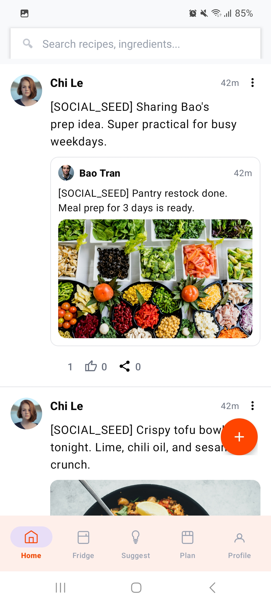

### 23127205 - Lâm Hữu Khánh
- Implement Push Notification feature (FCM).
- Add notification bell icon with unread badge on feed header.
- Trigger FCM push notifications for follow, like, and comment events.

Evidence

- Notification in app:

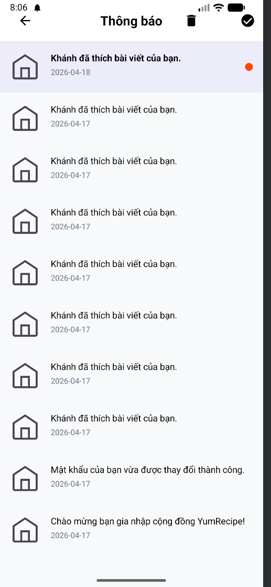

- Push notification:

- Email welcome:

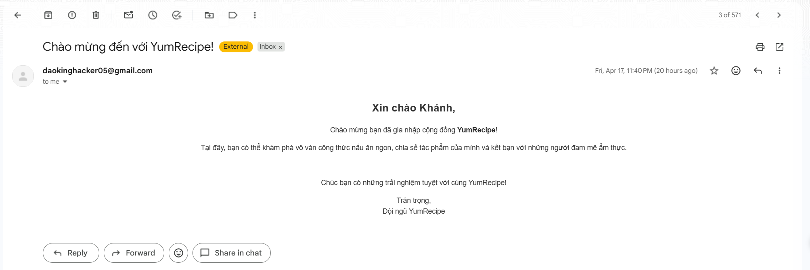

- Email reset password:

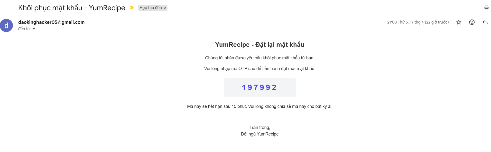

- Commit messages:

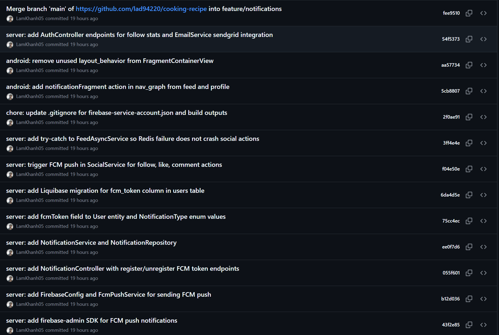

### 23127326 - Lê Mai Hoài Bảo
- Implemented API & UI for search user
- Implemented API to favorite recipes and integrated UI with it

Evidence

- Search user UI:

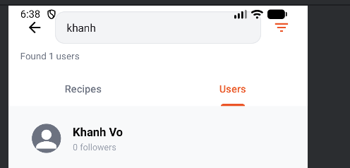

- Favorite tab in profile:

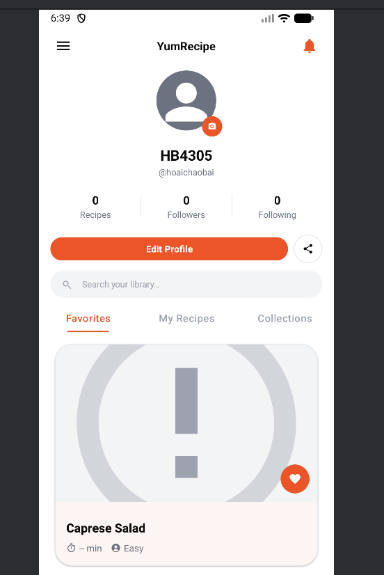
 
- Button to favorite/unfavorite a recipe:

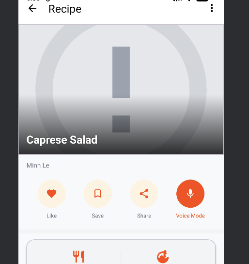

- Commit message:

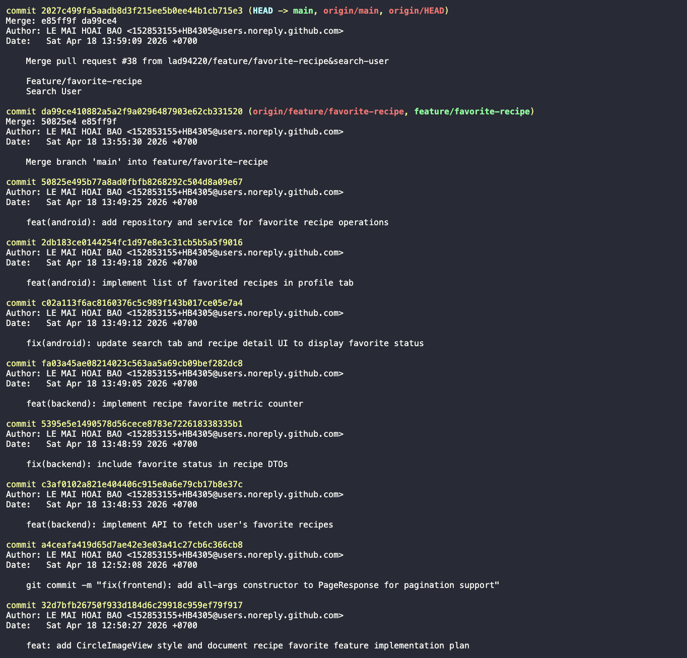
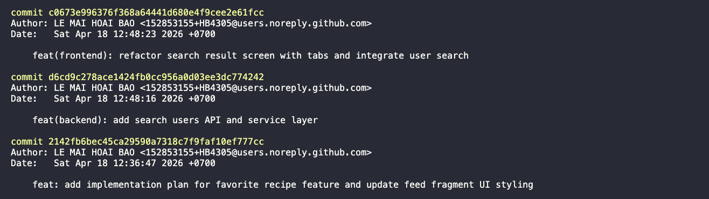

### 23127357 - Lê Anh Duy
- Wire the list of recipe to its details page.
- Refine the UI of creating recipe.
- Implement the "Change Ingredient using AI" feature.

Evidence

## AI Usage Declaration

### 23127122 - Nguyễn Duy Thịnh

#### 1. General Information

- **Tool name, version, and platform:** GPT 5.3 Codex, Medium thinking
- **Access time:** 2026-04-15

#### 2. Usage Details

- **Prompt used:** "hey can you create seed data for the social feature group (post, comments, share post,..) using applicationrunner or commandlinerunner or something like that"
- **Purpose of use:** To generate seed data for the social feature group, including posts, comments, and share post data, to facilitate testing and development.

#### 3. Content Declaration

- **Which content was generated by AI:**
  - SocialSeedDataRunner.java
- **Which content I modified after AI generation:**
  - Nothing, it ran correctly without any modification needed.

#### 4. Evidence of AI Usage

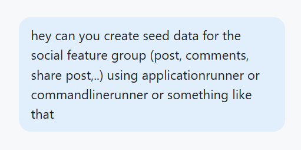

### 23127205 - Lâm Hữu Khánh

#### 1. General Information
- **Tool name, version, and platform:** Claude Sonnet 4.6 (Anthropic)
- **Access time:** 2026-04-15 to 2026-04-18

#### 2. Usage Details
- **Prompt used:** "As a senior developer, please create a comprehensive plan to implement push notification feature for an Android app using Firebase Cloud Messaging (FCM), including: FCM configuration on Android, creating FCM Service, designing notification UI with unread badge, creating API endpoints on Spring Boot server to register/unregister FCM token, and triggering notifications for events such as follow, like, and comment."

- **Purpose of use:** To create a comprehensive implementation plan for push notifications using Firebase Cloud Messaging, covering Android client setup, FCM service implementation, notification UI with unread badge, server-side API endpoints for token management, and event-driven notification triggers.

#### 3. Content Declaration
- **Which content was generated by AI:**
    - A detailed implementation plan for FCM push notifications, including Android manifest configuration, FCM service class structure, notification API endpoints on Spring Boot, and notification trigger logic in SocialService.
- **Which content I modified after AI generation:**
    - I modified the FCM service class and notification trigger logic to fit the existing project architecture and coding conventions.

#### 4. Evidence of AI Usage
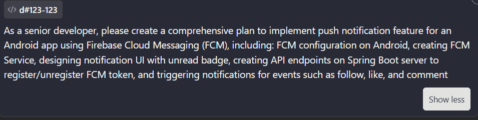

### 23127326 - Lê Mai Hoài Bảo

#### 1. General Information
- **Tool name, version, and platform:** Claude Opus 4.6 (Anthropic)
- **Access time:** 2026-04-18 13:00

#### 2. Usage Details
- **Prompt used:** "Trong vai một senior developer, hãy lên một plan toàn diện nhất để implement tính năng tim một recipe từ backend đến frontend (lưu ý rằng frontend đã có cái nút tim)"

- **Purpose of use:** To create a comprehensive plan for implementing the "like" feature for recipes, covering both backend and frontend aspects, ensuring that the existing "like" button in the frontend is properly integrated with the backend functionality.

#### 3. Content Declaration
- **Which content was generated by AI:**
    - A detailed implementation plan for the "like" feature, including database schema changes, API
endpoints, and frontend integration steps.
- **Which content I modified after AI generation:**
    - I run code and it works correctly without any modification needed.

#### 4. Evidence of AI Usage
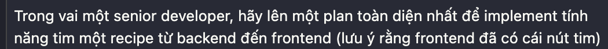

### 23127357 - Lê Anh Duy
#### 1. General Information
- **Tool name, version, and platform:** Claude Sonnet 4.6 (Anthropic), Codex 5.3
- **Access time:** 2026-04-12 to 2026-04-18

#### 2. Usage Details
- **Prompt used:** 
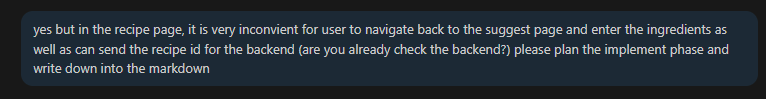

- **Purpose of use:** To create the plan and code for the UI of "Change Ingredient using AI" feature, which allows users to modify the ingredients of a recipe using AI.

#### 3. Content Declaration
- **Which content was generated by AI:**
    - A detailed implementation plan for the "Change Ingredient using AI" feature, including UI design, API integration, and frontend implementation steps.
    - `fragment_recipe_details.xml`, `IngredientReplacementRequest.java`, `IngredientReplacementResponse.java`, `RecipeDetailsViewModel.java`.

## Tasks Planned for Next Week

### 23127122 - Nguyễn Duy Thịnh
- Implement sharing with QR code + export to image.
- Refine UI for feed and article features.

### 23127205 - Lâm Hữu Khánh
- Implement user administration feature group.
- Implement system management and post moderation.
- Implement complaint handling and account restriction features.

### 23127326 - Lê Mai Hoài Bảo
- Itegrate the API voice command to the UI
- Implement API and UI for gallery feature
- Implement API and UI for save recipe feature
- Implement API and UI for history feature
### 23127357 - Lê Anh Duy
- Implement the remains stuffs.